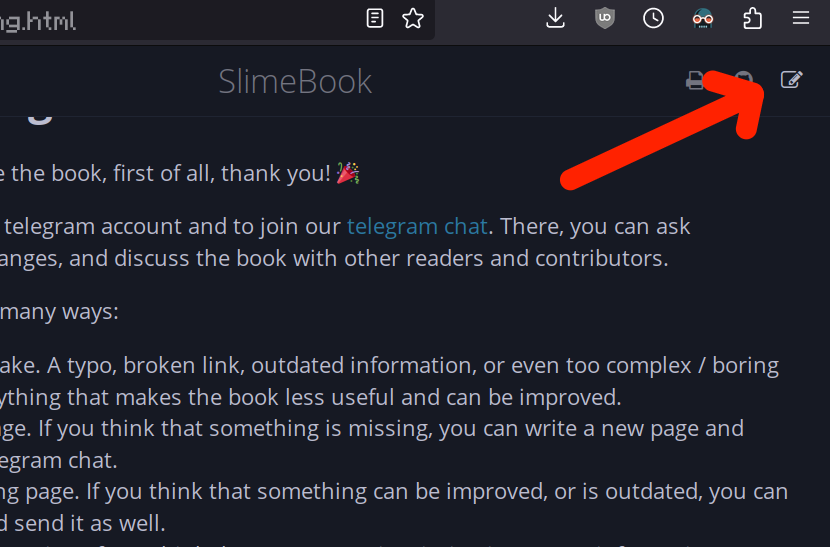
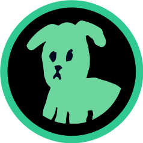

# Contributing

If you want to improve the book, first of all, thank you! 🎉

To do this, you need a discord or telegram account. Join our [discord](https://discord.gg/VZn9WU9Kpy).
There, you can ask questions, suggest changes, and discuss the book with other readers and
contributors. If you don't have a discord account, join our [telegram chat](https://t.me/slimepowerchat)
and contribute there.

You can contribute in many ways:

- Reporting a mistake. A typo, broken link, outdated information, or even too complex / boring
  explanation - anything that makes the book less useful and can be improved.
- Writing a new page. If you think that something is missing, you can write a new page and send
  it in discord.
- Editing an existing page. If you think that something can be improved, or is outdated,
  you can edit the page and send it as well.
- Adding new information. If you think that some page is missing important information,
  or would be more useful with a screenshot / video, you can add it.
- Spreading the word. If you think that the book is useful, you can share it with your friends,
  on social media, or in other communities. *(note: as of now, this type of contribution is not
  rewarded, but it's still very helpful)*
- Donating. If you think that the book is useful and want to support it, you can donate
  on [PotLock](https://app.potlock.org/?tab=project&projectId=slimebook.near) or directly
  to `slimebook.near`. The money will be used to reward contributors and improve the book.

## How the book is structured

The book is structured in levels, and each level has a few pages. The levels are ordered by
difficulty, and the pages inside one level are not ordered. Every page is written in
markdown (.md), a format that is easy to read and write, and can be converted to HTML, PDF, and
other formats. You can find more about markdown [here](https://rust-lang.github.io/mdBook/format/markdown.html).
Or if you don't want to do this, you can just send a .txt file and I'll add headings, links,
images, and other formatting.

## Editing a page

1. Go to the page you want to edit
2. Click the &nbsp; <div class="fa fa-edit"></div> &nbsp; icon in the right top corner:
   
   
3. Copy the content of the page, and paste it in some text editor. For
   example, [EditMyMarkdown](https://editmymarkdown.com)
   is a good online editor with preview of formatting
4. Edit the page until you're happy with it
5. Send the edited page in discord or telegram chat

If you want to create a new page, you can start with a template:

```markdown
# Title

Contents
```

## Writing guidelines

- Be clear and concise. If you can explain something in 1 sentence, don't use 3
- Use simple words. Don't use technical words unless necessary. The main audience of the
  book is non-technical users who are new to NEAR, or new to web3 / crypto, we don't
  want to scare them. But depending on the level of the page, more advanced concepts are
  welcome
- Use images and videos if they can help to understand the topic
- Use links to other pages in the book and to external resources
- If you want to contribute but it's too much for you, you can still send the
  information and I'll edit it, though you'll get less reward

## Rewards

For every contribution, you will be rewarded with NEAR tokens. The amount of tokens
depends on:

- The quality of the contribution. This is perhaps the most important and complex
  factor. It includes the quality of the writing, the usefulness of the information,
  the clarity of the explanation, and the relevance of the information. The quality is
  a subjective factor, but I'll try to be as fair as possible. Ideally, I could set up
  a DAO, but I believe that simplicity and speed are more important for now.
- The amount of work. This includes the length of the page, the amount of new information,
  the amount of changes, and the amount of work required to make the contribution. Images
  and videos are welcome and can increase the reward, but please don't spam 20 images on 1
  page. For example, this page (contributing) is not very long and took me about 2 hours
  to write (+ some time to set up potlock, treasury account, the "Suggest an edit"
  button in the corner, finding an online editor, and other things, but let's ignore this),
  so it'll be rewarded with about 5-20 NEAR, depending on the other factors.
- The amount of money in the [slimebook treasury](https://nearblocks.io/account/slimebook.near).
  The treasury is filled with donations and maybe some grants in the future. If you contributed
  while the treasury is almost empty, you can still be fairly compensated in the future, but
  it's not guaranteed.

## Have questions?

Join our [discord](https://discord.gg/VZn9WU9Kpy) or [telegram chat](https://t.me/slimepowerchat).

## They donated to Slimebook

<div style="text-align: center">
  <a target="_blank" href="https://shitzuapes.xyz/"></a>
</div>
