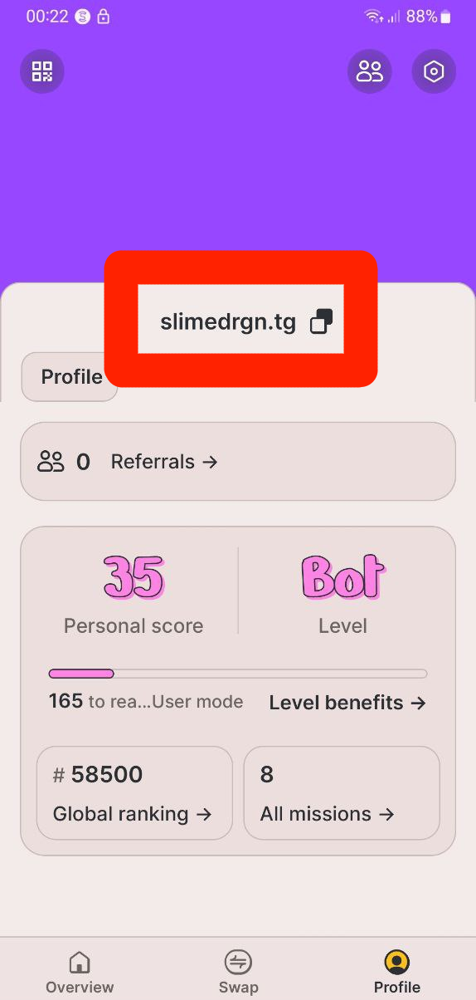
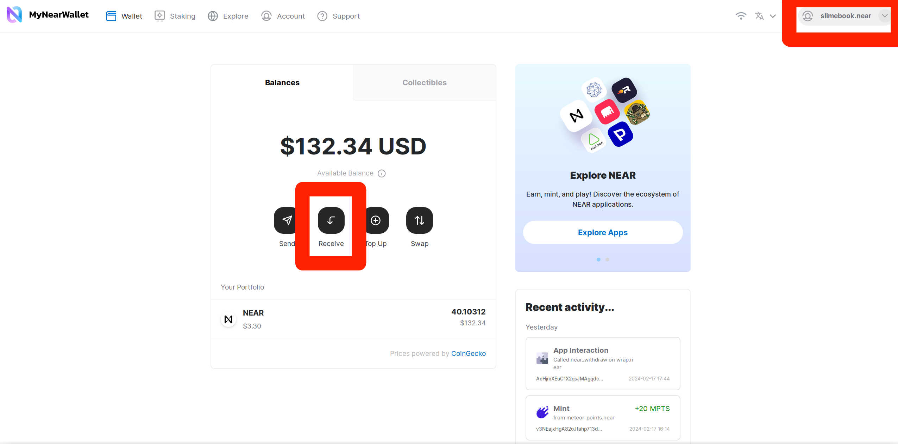
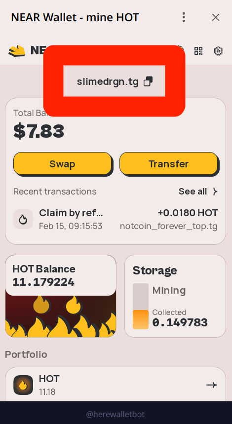
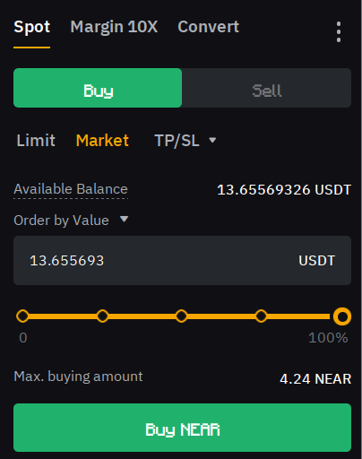
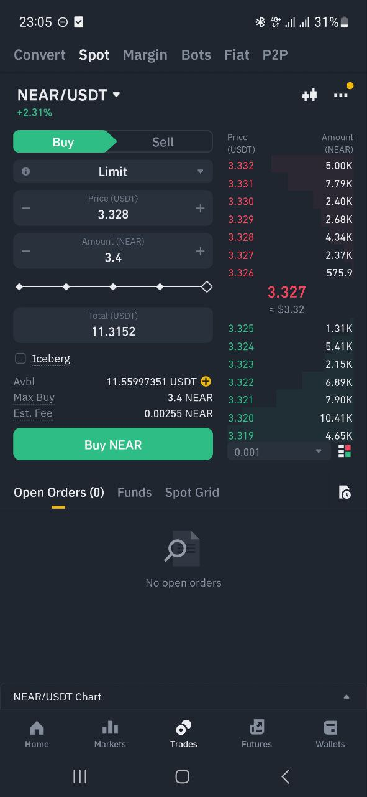
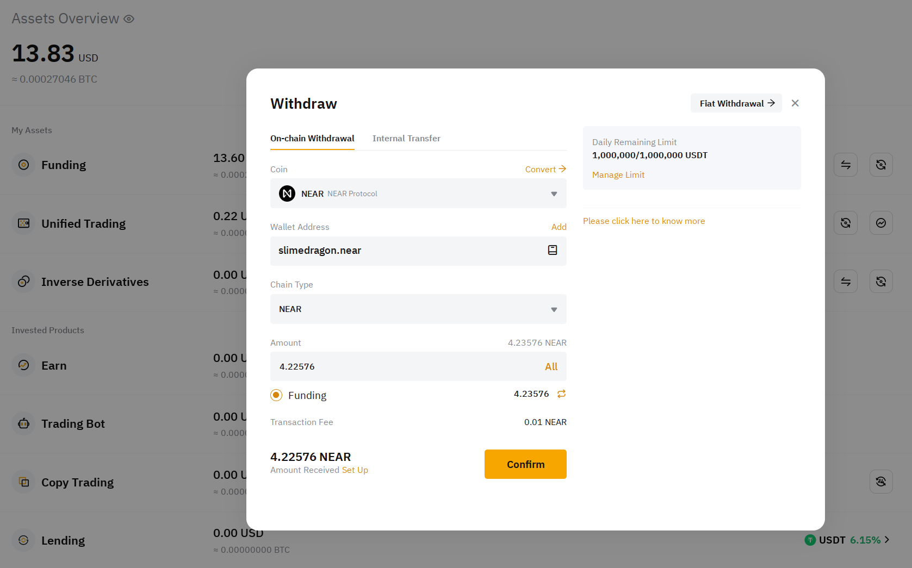
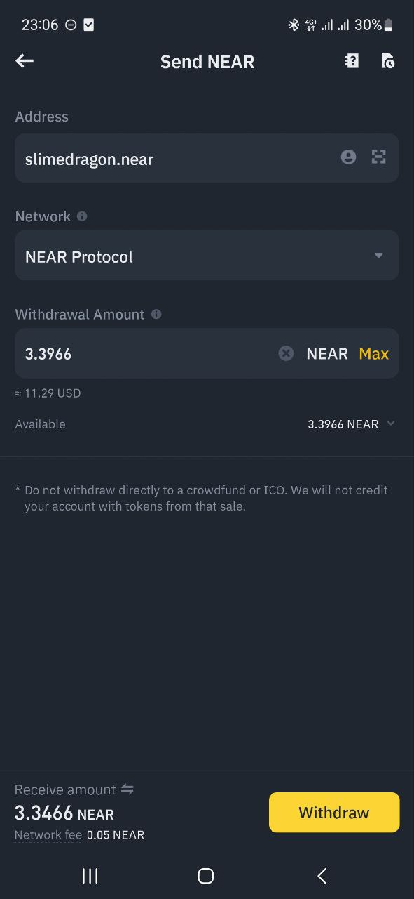

# Receiving NEAR

Generally, there are 4 ways to receive NEAR:
1. From another NEAR account
2. From an exchange
3. From a different blockchain
4. Earn NEAR

## From another NEAR account

If you're receiving NEAR from another NEAR account, you need to give them your
account ID. Let's find it:

Meteor Wallet:

HERE Wallet:

MyNearWallet has 2 ways: It's displayed in the top right corner, or you can click
"Receive" to open a page with your address and QR code:

HOT Wallet:

If you're coming from a different blockchain, you might be used to having
a long string of random characters as your address. NEAR mostly uses human-readable
names instead, and you can have multiple accounts under the same name.
Don't confuse this with ENS or similar services, NEAR names are not a
good-looking mapping to an address - **it IS** your address. More information about
addresses: [NEAR Accounts](../lvl4/account-model/account-ids.md)

## From an exchange

If you're transferring from an exchange, depending on the exchange, it can take
1-30 minutes for the transfer to come, but transfers between wallets usually take
1-2 seconds. As an address, you can use the same NEAR account ID as you would
for receiving from another NEAR account. Here's how to do it with Bybit
and Binance, but the interface is more or less the same on other exchanges:

1. Buy NEAR (you may need to deposit some other currency first):

   Bybit:

   

   Binance:

   

2. Navigate to "Assets". Some exchanges may have a "Trading balance" and a "Funding
   balance" - usually you would need to transfer from the "Funding balance" to the
   "Trading balance" first. But if you're not sure where to find it, you can just
   skip this step, some exchanges do it automatically.
3. Find "NEAR" in your assets and click "Withdraw". On some exchanges, you may need
   to click "Withdraw" first and then select "NEAR" from a dropdown.
4. Enter your NEAR account ID and the amount you want to withdraw:

   Bybit:

   

   Binance:

   

5. Confirm the withdrawal. You may need to confirm it via email, 2FA, and password.

## From a different blockchain

If you're transferring from a different blockchain, you need to use a bridge. The
best bridge for Ethereum is [Rainbow Bridge](../lvl2/rainbow-bridge.md). It's an official
**trustless** two-way bridge, meaning that you don't need to trust the company that runs
it, and it's less prone to hacks. If you want to bridge from BNB Smart Chain, Solana,
Polygon, or another blockchain, you need to use a different bridge or an exchange. For
small amounts (less than $1000), you can use [Allbridge Classic](https://app.allbridge.io/bridge) or [Rubic Exchange](https://app.rubic.exchange/?fromChain=SOLANA&toChain=NEAR&to=NEAR&from=SOL&amount=10),
but you can easily lose a good percentage of your money due to [slippage](../lvl2/exchanging-tokens-ref.md#slippage).
I recommend [using a centralized exchange](#from-an-exchange) for larger amounts. And for small
amounts, too, if you have an account on an exchange, in most cases it's the cheapest option.

## Earn NEAR

You can earn NEAR by:
- Contributing to this book 💚 If you found a mistake, broken link, wrote a new page,
  added new information on an existing page, or something else, read [Contributing guide](../contributing.md)
  and you'll be rewarded.
- Completing tasks on [heroes.build](https://heroes.build), there are a lot of bounties
  for different skills, and you can earn NEAR for completing them.
- Doing something useful for the community and applying for a grant in [DevHub](https://near.social/devhub.near/widget/app)
  (for developer-related projects), [Marketing DAO](https://near.org/ndcdev.near/widget/MDAO.App)
  (for marketing-related projects), [Creatives DAO](https://app.astrodao.com/dao/creativesdao.sputnik-dao.near)
  (for creative art-related projects), [Public Degens](https://near.org/public-degens.near/widget/Contests)
  (for near content makers), [OnboardDAO](https://www.onboarddao.org/) (for wallet developers and
  other projects related to onboarding new users), [Globe DAO](https://gov.near.org/c/community/globe/112)
  (for projects targeted at local communities, non-blockchain communities, etc., maybe your
  country / region also has a DAO), [Near Foundation](https://near.foundation/), [NEAR Horizon](https://www.hzn.xyz/),
  and other organizations.
- [Earn other tokens using other ways](fts.md#more-about-earn) and then [exchange](../lvl2/exchanging-tokens-ref.md)
  them for NEAR.
