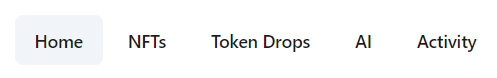
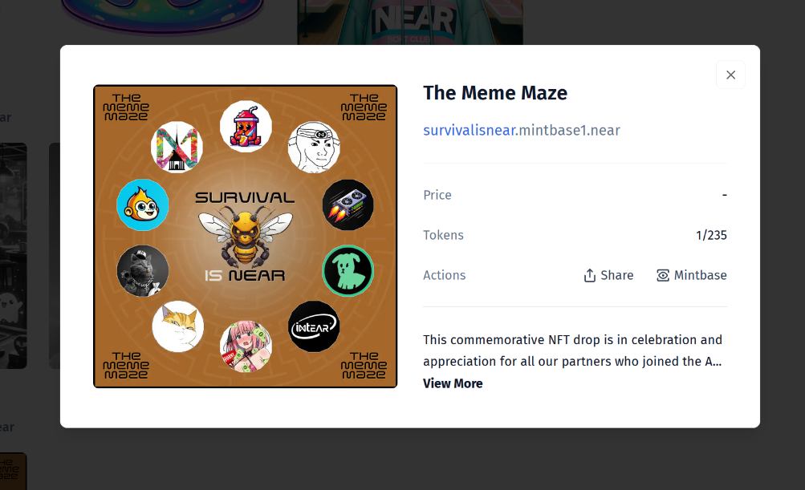
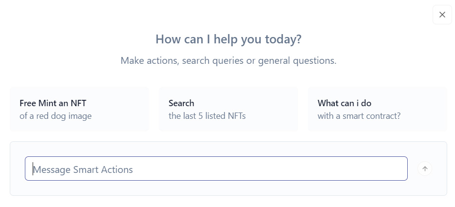
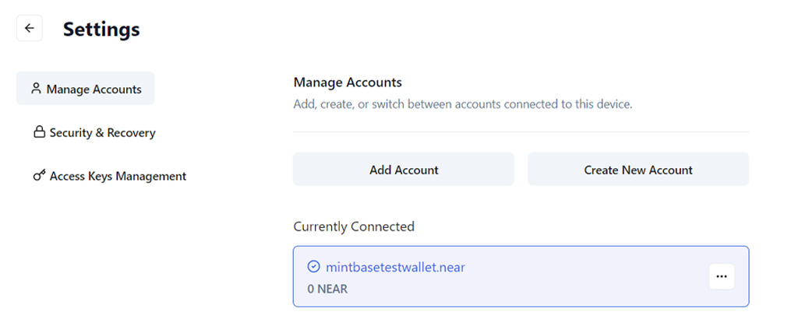

# Bitte Wallet

> NOTE: Bitte Wallet was called Mintbase Wallet a few months ago, and has rebranded since. The existing images and videos have not been updated, because the interface is the same, just the logo has changed.

[Bitte Wallet](https://wallet.bitte.ai) is a wallet built by [Mintbase](../../lvl4/mintbase.md). When you register, it uses passkeys for authorization, and your keys live in your browser. If your device doesn't support passkeys, you can use a password.

Once you have enough funds to worry about recovery of your account, you can create a seed phrase and use it in any other wallet.

## Creating an account:

<video src="./bitte-wallet-create.mp4" autoplay loop></video>

On Windows and Mac it will require a password or pin code, on phones it will require a fingerprint, Face ID, or other biometry options, and on Linux it doesn't really work out of the box because of poor passkey support, so just use a password for now.

## Tabs

### NFTs

Here you can see your [NFTs](../nfts.md) and go to [Mintbase](../../lvl4/mintbase.md) to transfer or sell them.

### Bitte Drops

This feature allows you to create NFTs that can be minted by anyone for free.

> TODO: Drops v2 soon with more features.

Let's create an NFT drop:

<video src="./bitte-wallet-drops.mp4" autoplay loop></video>

Now you can [claim the drop](https://wallet.bitte.ai/claim/slimebook) that we just created.

### AI

Write what you want to be done, and the Bitte AI will try to help you.

During my research, I couldn't find any particularly useful tasks that it can fulfill, but Bitte Wallet doesn't support token swaps out of box, so you can use AI to swap tokens. But I'd recommend using [Ref Finance](../../lvl2/exchanging-tokens-ref.md) instead of swaps inside wallets.

At the time of writing, Bitte AI can create drops, manage NFTs, swap tokens, and this list is rapidly expanding.

### Activity

This just takes you to the [NearBlocks](../../lvl3/nearblocks.md) page of your account.

### Settings

Here you can manage your [keys](../../lvl4/account-model/keys/index.md), multiple accounts, disconnect connected apps.
