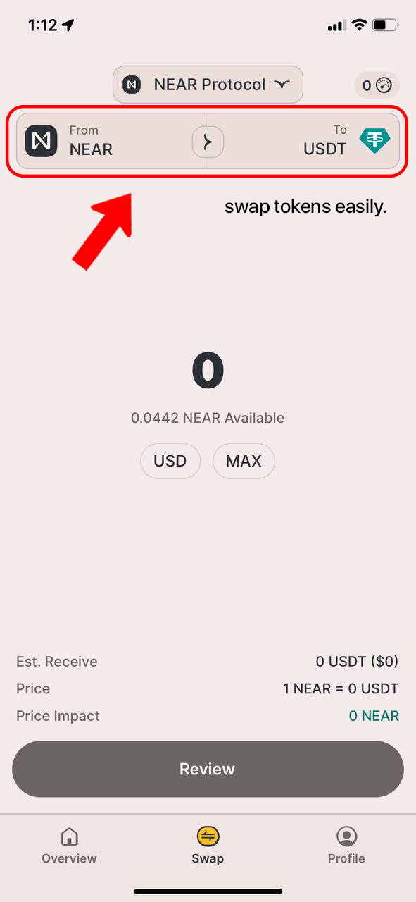

# HERE Wallet

[HERE Wallet](https://www.herewallet.app/) is a mobile NEAR wallet that has an app for
both Android and iOS, and a limited version of it can also be accessed from web, though
it's definitely not priority for the team, so I wouldn't recommend using it.

> Tip: Once you register, you receive 10 gas-free transactions

Let's start by creating a wallet and exploring HERE wallet. You can download it [HERE](https://download.herewallet.app/slimebook):

### 1. Create new Account:
<video src="/lvl1/wallets/here-wallet-create.mp4" autoplay loop></video>

Don't forget to [save your seed phrase](../../lvl4/account-model/keys/where-to-save-seed-phrase.md)!

### 2. Explore Overview Tab:
View Recent Transaction + Wallet Balance.

### 3. View Portfolio:
You can see your tokens in the 'Portfolio' tab:

### 4. Do Transactions:
Buy or withdraw cryptocurrency with Fiat money like USD, INR, AED, directly in HERE Wallet
or send your tokens to other accounts:

### 5. Explore Settings:
You can secure your HERE app with FaceID, TouchID or passcode, change RPC, manage your
[Access Keys](../../lvl4/account-model/keys/index.md), and more.

### 6. NFT Section:
Send or receive [NFT](../nfts.md)s:

### 7. Swap:
You can exchange tokens in the wallet:

## Score

Score is a system that measures your activity in the app. It is attached to the account
and cannot be sent to friends or bought for money. It can be accumulated for the use of
certain features, contests, inviting friends, and can only increase.

### Levels
> 0–100: (Not a) BOT
> 500–1500: USER
> 400, 800, 1200: Unlock a secret feature (Special Reward)
> 2500: God mode. Gas free transactions / cashback for swaps.

#### How to earn Score

You can earn score by opening the app every day, making swaps, staking, inviting friends,
connecting Binance, and engaging in other activities. You can find the most recent list
of activities that earn you score in the app.

#### Benefits of Higher Scores:

Note that this was taken from the HERE Wallet official site, which at the time of
writing is almost dead, most images and pages are broken, and 9.2% staking APY is
crazy high (higher than native staking with 0% fee), so I'd take this with a grain
of salt.
