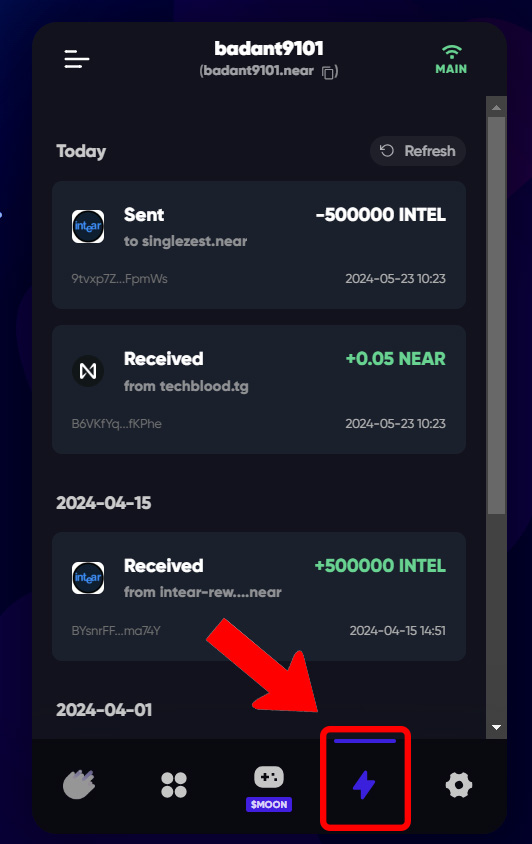
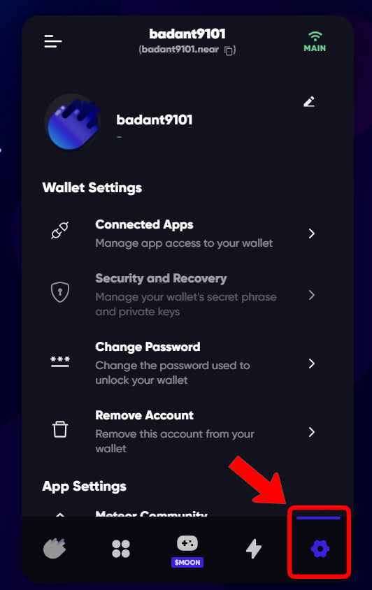
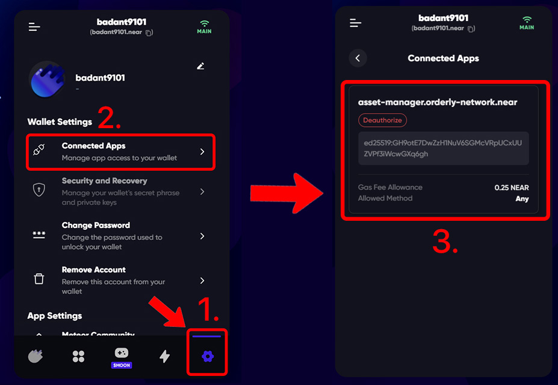
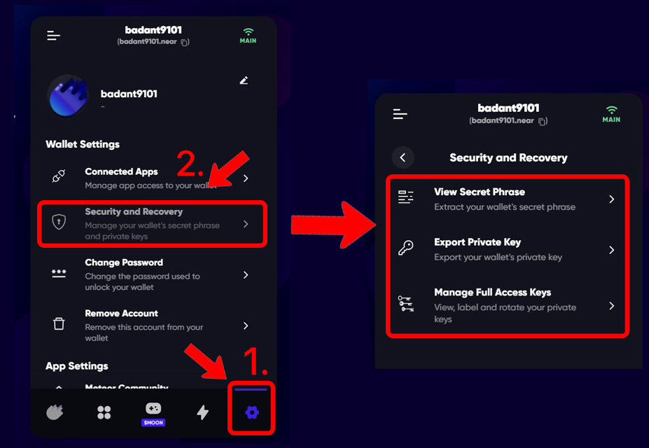

# Meteor Wallet

[Meteor Wallet](https://wallet.meteorwallet.app/add_wallet/create_new?postfix=slime)
is (in my opinion) the simplest and most user-friendly NEAR wallet. It's a web
wallet that can also be used as a Chrome extension.

To create a wallet, open the [Meteor Wallet](https://wallet.meteorwallet.app/add_wallet/create_new?postfix=slime)
website and enter your username:
<video src="/lvl1/wallets/meteor-wallet-create.mp4" autoplay loop>

Yes, as simple as that.

## Next steps
Now you can move some NEAR in your wallet ([Receiving NEAR](../receiving-near.md)) or continue exploring other Meteor
Wallet's features.

In the example above, our address is `simpleisland-slime.near`.

### Sending NEAR
To send NEAR to someone, you need to know the recipient's account ID (username).
When you have it, you can send NEAR to them:
 
<video src="/lvl1/wallets/meteor-wallet-send.mp4" autoplay loop>

You can send other tokens when you click at them, the same menu will open for the selected
token:

<video src="/lvl1/wallets/meteor-wallet-send-ft.mp4" autoplay loop>

### [NFTs](../nfts.md)
Meteor Wallet has a built-in NFT viewer, where you can see your NFTs in the wallet,
view their traits, floor prices, transfer NFTs, and more.

### Transaction history

Under the "lightning bolt" sign, you can see your transaction history:

## Settings

Settings in Meteor Wallet are located here:

1. **Connected Apps**: Here you can see all the apps that you have connected your wallet
   to (or technically, created a [Function Call key](../../lvl4/account-model/keys/index.md#function-call-access-key)).
   You can also revoke access to these apps by clicking "Deauthorize".

   

2. **Security and Recovery**: This part of the wallet contains your account's
   [seed phrase](../../lvl4/account-model/keys/where-to-save-seed-phrase.md). You can
   view or export your seeds & private key from this page. It also gives you an option
   to manage [Full Access Keys](../../lvl4/account-model/keys/index.md#full-access-key)
   and [Function Call Access Keys](../../lvl4/account-model/keys/index.md#full-access-key)
   of your account.

   

3. You can also provide feedback, share your issue with technical support, set a password, remove the account from meteor wallet, and other things from this page.
