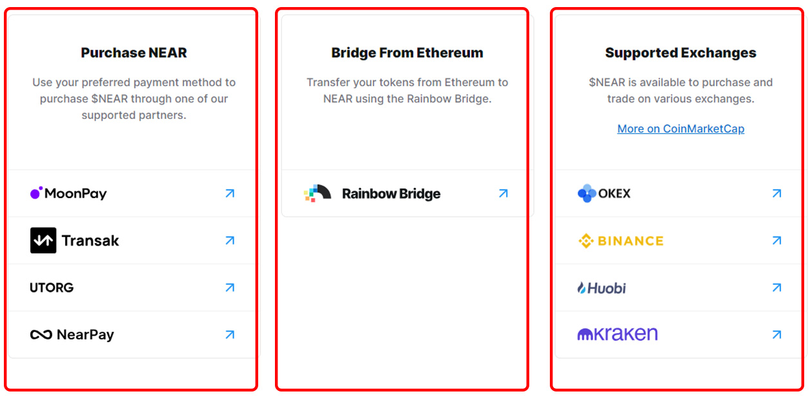
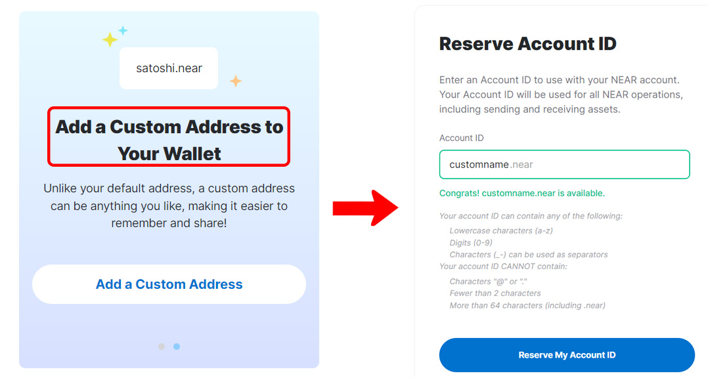
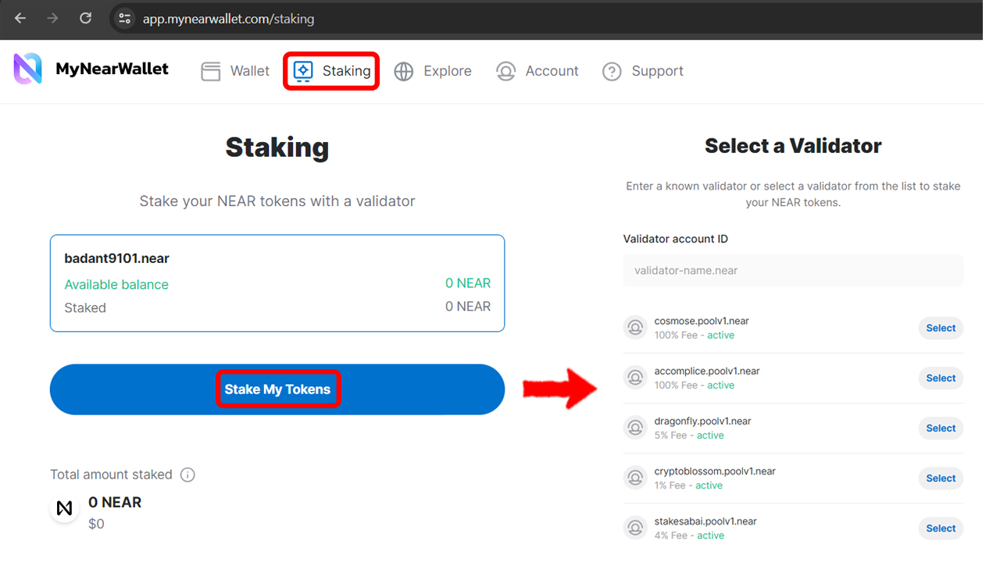
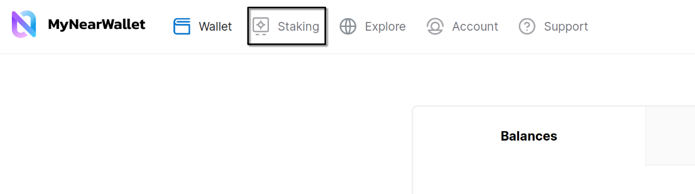
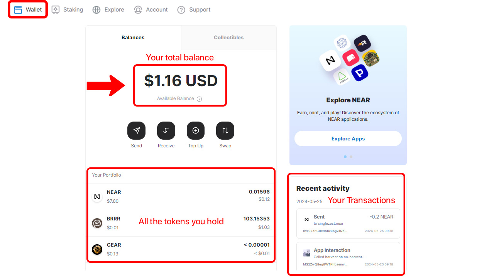
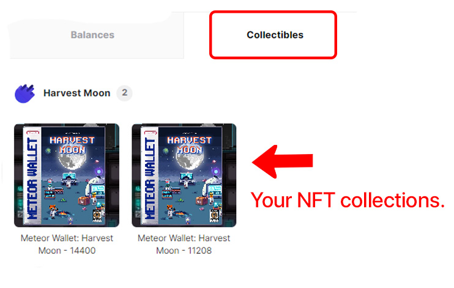
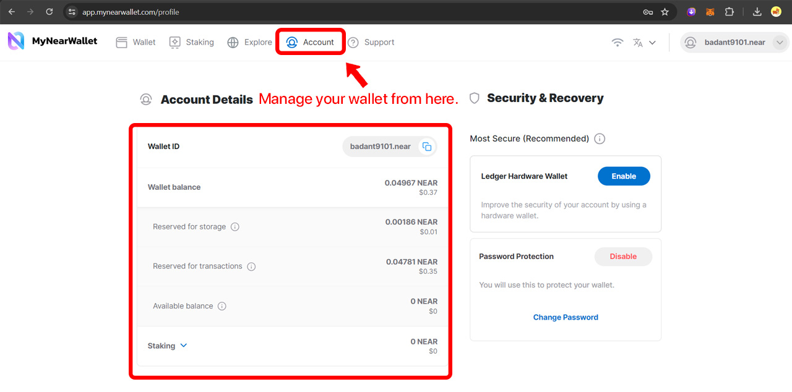
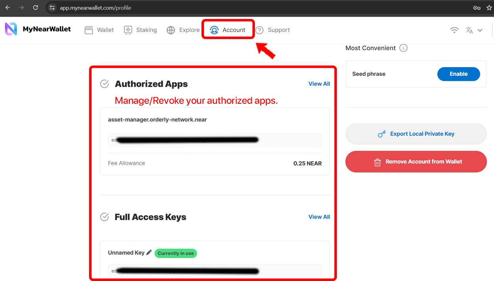
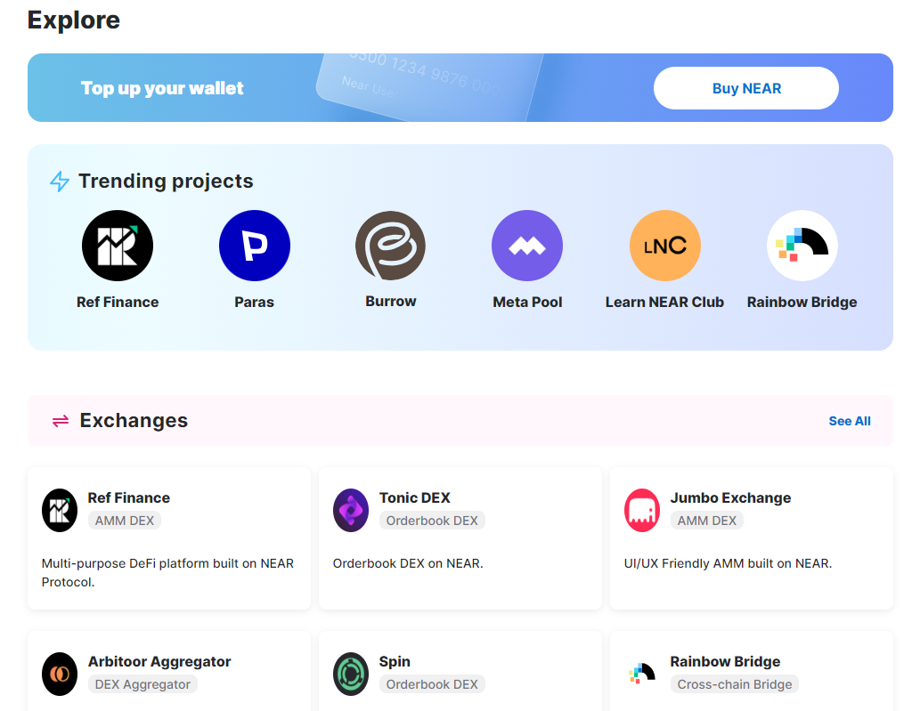

# MyNearWallet

[MyNearWallet](https://www.mynearwallet.com/)** is a web wallet, accessible at [app.mynearwallet.com](https://app.mynearwallet.com).

> WARNING: Don't google "MyNearWallet" and click on the first link you see. MyNearWallet
> is open source and anyone can create a website with absolutely the same name and design,
> and someone is promoting the fake website on google ads. Always double check the URL
> before logging in.

### Creating a Account

<video src="./my-near-wallet-create-account.mp4" autoplay loop></video>

Now there are several [ways](../receiving-near.md) you can deposit tokens / NEAR in your newly created wallet.

### Named Address

Unlike Meteor wallet, which lets you create custom named account from the first step, on MyNearWallet, you'll need to reserve your [named address](https://app.mynearwallet.com/create) after initiating the wallet.

To do this, first you will create an implicit account (64 characters) if you haven't yet, and then click "Add a Custom Address" in the banner on the right, or click at the right top corner with accounts > Create New Account, and you will be able to choose a name. Note that you will be charged a small fee for this.

### Staking

To natively stake NEAR, click the "Staking" tab in the top, and you will see a list of validators with different fees and APY, these are the options to choose from. To know more about staking, read the [staking guide](../../lvl2/staking.md).

### Main page

This main screen contains all the information about your total balance, all the different tokens you hold and your recent transactions.

### NFT section

You can view your nfts and transfer them to other accounts.

## Managing your Wallet:

The "Account" tab provides options to manage your selected account and recovery options in MyNearWallet:

Here's a list of things you can do in this settings tab:
1. View wallet balance breakdown and staking details
2. Change password
3. Connect to a hardware wallet
4. Export [seed phrase](../../lvl4/account-model/keys/where-to-save-seed-phrase.md) and Private Keys.
5. Manage authorized apps and [Access keys](../../lvl4/account-model/keys/index.md):

   

It also provides [direct links](https://app.mynearwallet.com/explore) to dapps in Near ecosystem under one page:

But I recommend using [NEARCatalog](https://dev.near.org/applications) for a more comprehensive and maintained list of applications.
