# Exchanging Tokens

If you want to do various things in the NEAR ecosystem, you can't just have NEAR tokens
and do everything with it. Some [NFT](../lvl1/nfts.md)s can be bought only with a
specific token, some [DAO](../lvl3/dao.md)s require a specific token to vote, or maybe
you just don't want to worry about the price of NEAR and want to use a [stablecoin](stablecoins.md).

Since we're covering the NEAR ecosystem, we'll focus on DEXes (decentralized exchanges)
that are available on NEAR, but there are other ways to exchange tokens, like
[centralized exchanges](#cex) and [OTC](#otc).

At the time of writing, the biggest DEX on NEAR is [Ref Finance](https://app.ref.finance/).
To start using it, you have to [connect your wallet](../lvl1/wallets/index.md#connecting-to-dapps)
and then you can start swapping tokens.

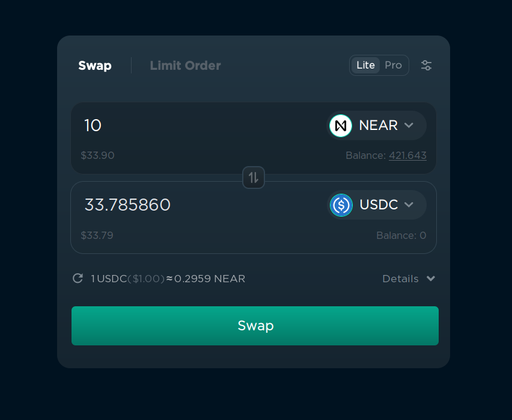

To convert one token into another, follow these steps:

1. Choose the token you want to swap from on the right of the first input field ("NEAR" on the screenshot).
2. Choose the token you want to swap to on the right of the second input field ("USDC" on the screenshot).
3. Enter the amount of the tokens you want to swap.
4. Click "Swap" and confirm the transaction in your wallet.

Yes, it's that simple. But if you're going to do it often, you should be aware of these
things:

## How prices work

The price of a token depends on how much people buy and sell the token. If a lot of people
are buying a token, the price goes up, and if a lot of people are selling a token, the
price goes down. If you want to know more about technical details and the formula, you
can read about [liquidity](../lvl4/providing-liquidity-ref.md#what-is-liquidity).

## Price impact

If you're buying or selling a lot of tokens at once, the price can change a lot,
depending on the liquidity of the token. If the token has a low liquidity, the price
can change by a lot, even if you're swapping just $10. If the token has a high liquidity,
the price will not change by much, even if you're swapping $10,000 at once. This could
potentially lead to a situation where you change the price by 10%, and your average buy
price is 5% higher than the current price.

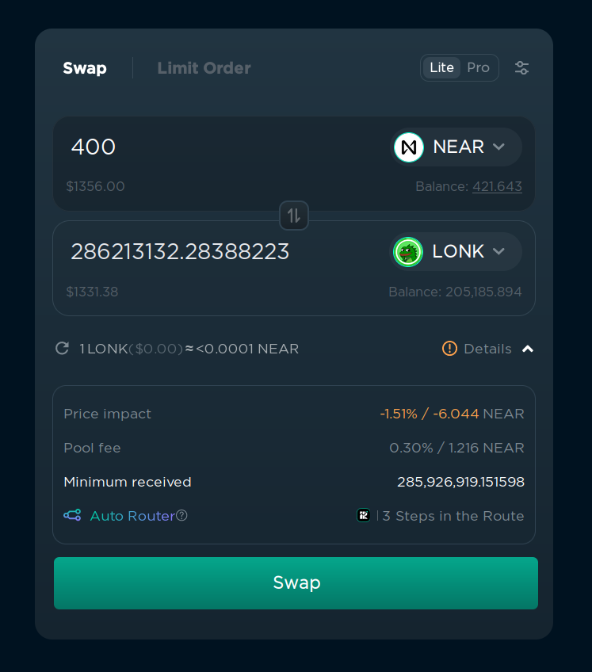

If the price will be changed by more than 1%, ref.finance will show you a warning about
the price impact and an estimated loss under "Details" in the bottom right corner. You
can ignore it if you're sure that you want to swap the tokens, but be aware that you'll
get a bad price.

## Slippage

Slippage is the difference between the expected price of a trade and the price at which
the trade is executed. It can happen when the market is volatile and the price of the
token changes between the moment you click "Swap" and the moment the transaction is
confirmed. If the slippage is too high, the transaction will fail. You can set the
maximum slippage in the settings in the top right corner.

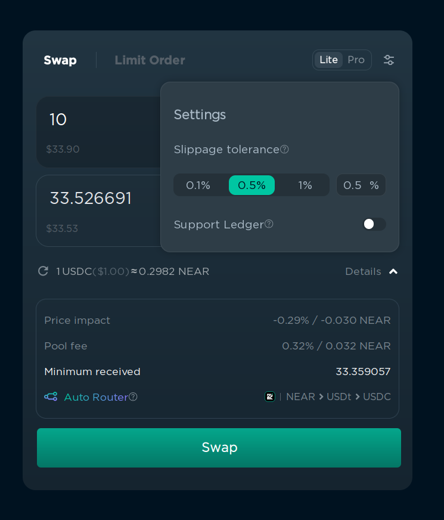

This is done to prevent you from losing money when the price changed too much between
the moment you clicked "Swap" and the moment the transaction was confirmed. For example,
if you want to swap 1 NEAR for 3.37 USDC, and the price of NEAR changes from $3.37 to $3.10,
the transaction will fail, because the price has changed by a lot. It also protects you
from "sandwich attacks", where someone can manipulate the price of the token by buying
right before your transaction and selling after your transaction, so you buy for a higher
price. These attacks are not common because they're much harder to execute on NEAR, but
it's still better to set slippage to a reasonable value.

I recommend setting it to 0.1% for popular tokens, and 0.5% for less popular tokens,
but if the swap constantly fails because of "slippage error", you can increase it farther.
If you're trading a token that has [transfer fees](../lvl1/fts.md#transfer-fees), you
can also increase the slippage to cover the fee. You can see the amount you are guaranteed
to receive under "Details", and if the amount is less than you expect, the transaction
will be reverted and you will get your tokens back.

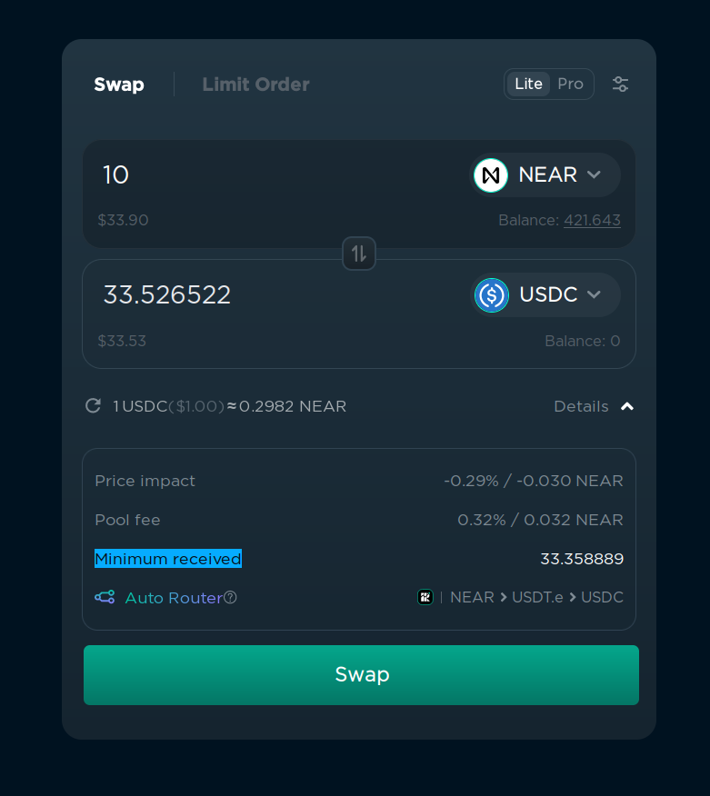

If you want to buy a token just after the launch, you should set the slippage to 5-10%
because the price can change a lot in a few seconds.

## Routing

Ref.finance will try to get the best price possible by combining multiple tokens pairs.
For example, sometimes instead of swapping NEAR -> UDSC, it will be better to swap
NEAR -> ETH -> USDC. This is called "routing". You can see the routing details if you
enable "Pro" mode in the top right corner.

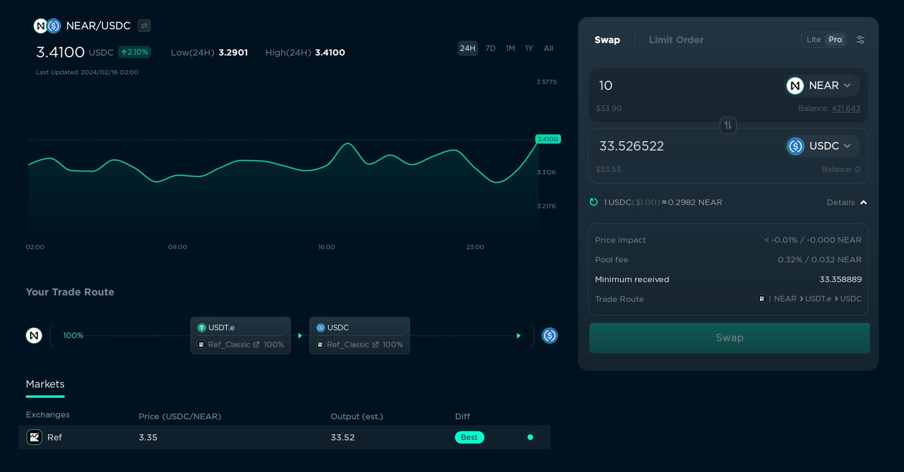

In this example, it will swap NEAR to USDT.e, and then USDT.e to USDC. It can also
route using the transaction using different paths, for example, swap 14% directly
to USDC, and 86% to USDT.e, and then swap USDT.e to USDC. This is done automatically,
so you don't have to worry about it, but it's good to know that it's happening.

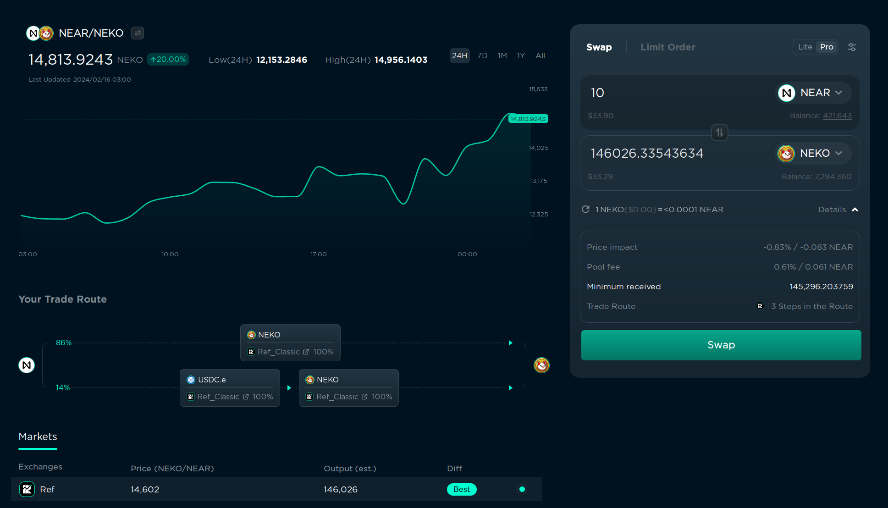

If you enabled Pro mode, you can also enable Trisolaris routing. Trisolaris is the
most popular DEX on [Aurora](../lvl4/aurora.md), and if the token is available on
both NEAR and Aurora, it will try to find the best between both chains. This is also
done automatically, but you can choose the route manually in the left bottom corner
if you want.

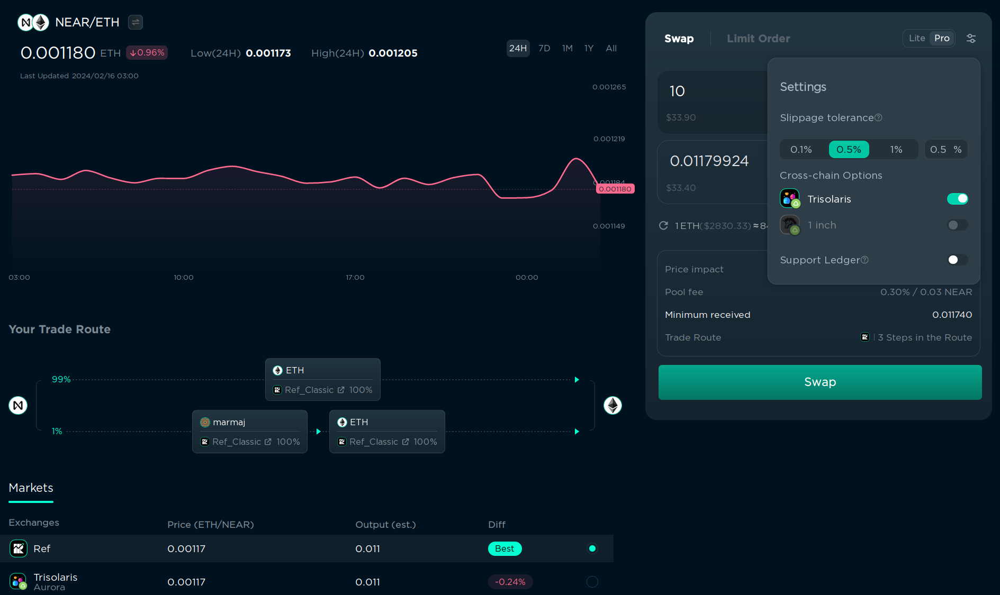

## Trading less popular tokens

Not all tokens are available in "Select a token" menu, but if you have a token address
(or contract address), you can enter it manually in the "Search name or paste address..."
field. After that, click the "Add token" button and confirm the transaction. The transaction
is needed to save the token in your list of tokens, and it will cost a small [storage fee](../lvl4/account-model/storage.md#storage-fee).
After that, you will be able to find the token in the "Select a token" menu. As the
project gains more recognition, Ref's team might [whitelist](https://gov.ref.finance/) it
so that this action is no longer necessary.

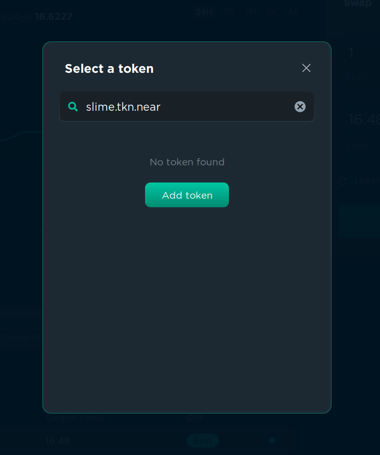

## Limit orders

If you want to buy a token for a specific price, you can use a limit order. This will
create a transaction that will be executed when the price of the token reaches the
price you specified. This is useful if you want to buy a token, but you think that the
price is too high right now, and you want to buy it only if the price goes down. You
can toggle between "Swap" and "Limit Order" in the top left corner of the swap menu.

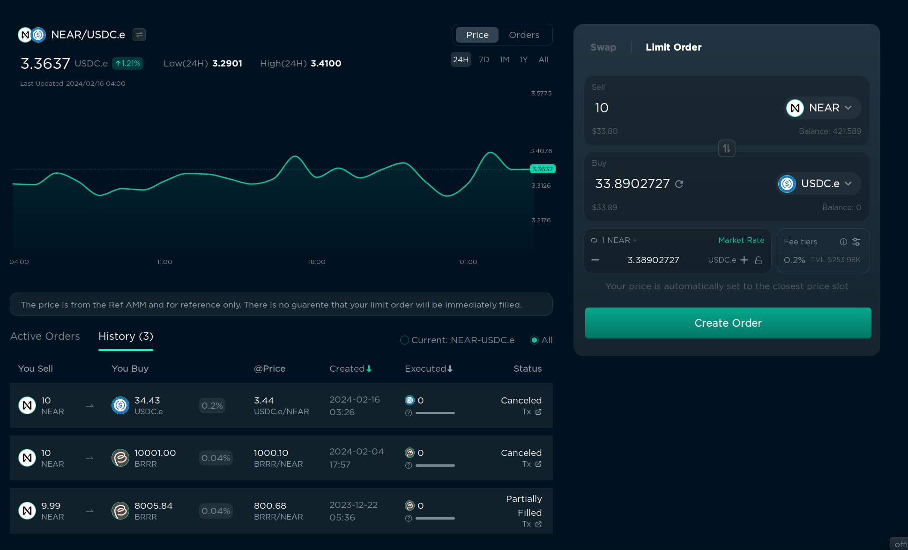

You can see a chart and order history on the left, but let's focus on the right side.

1. In "Sell" you specify the tokens to buy/sell and the amount you want to sell, it's just
   like in the "Swap" menu, but the choice of tokens and buy/sell combinations is very
   limited.
2. In "Buy" you can specify the token you want to buy and also the amount. The order
   price will be calculated automatically. Or you can set the order price in the bottom
   left corner and the receiving amount will be calculated automatically. You can click
   "Market Rate" to set the order price to the current market price, and then
   increase/decrease it as you want.
3. In "fee tier" you can choose the fee you want to pay for the order. But usually there
   is only 1 active tier with all orders, and it's selected by default, so I don't
   recommend changing this.
4. Click "Create Order" and confirm the transaction in your wallet. You will need to pay
   a [storage fee](../lvl4/account-model/storage.md#storage-fee) of 0.1 NEAR, and the fee
   will not be refunded when the order is executed or canceled, so for small transactions
   it could better to use "Swap" instead of "Limit Order".

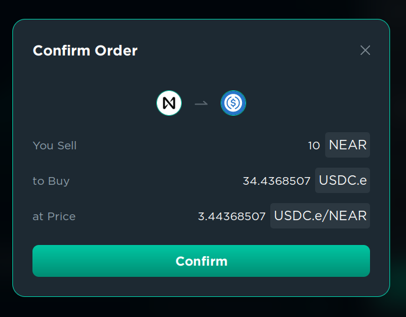

Done. Now you can wait for the price to reach the price you specified.

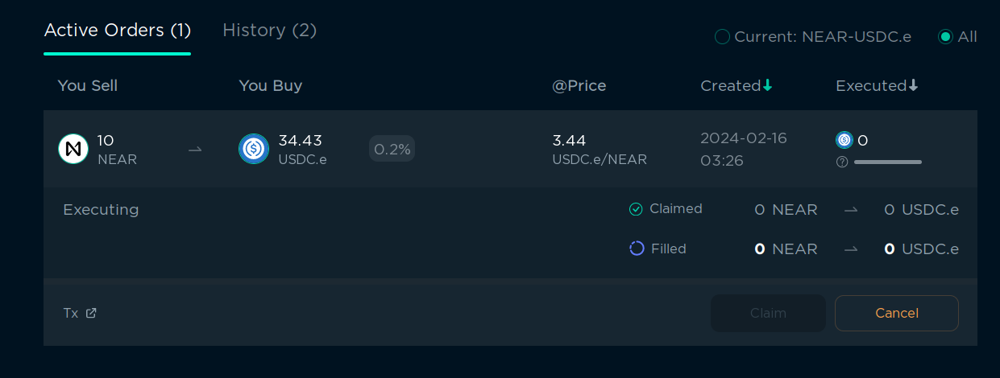

You can see your active orders in the right bottom corner. You can cancel them at any
time, or claim the tokens you wanted to buy if the order was executed. It will be
executed automatically when the price reaches the price you specified.

> You can learn more about Ref in [the official documentation](https://guide.ref.finance/)

## Orderly spot/perpetual trading

Orderly is a protocol that allows you to trade spot and perpetual tokens with more
efficient liquidity. It's a separate product, but the interface in hosted on ref.finance.
You can find Orderly as "Orderbook" in the top left corner of the ref.finance interface:

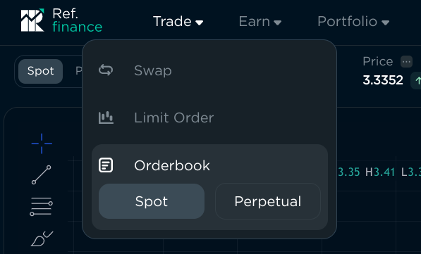

> **Warning** you probably don't need to use Orderly if you're not a professional trader.
> It's more complex than ref.finance, and it's designed for high-frequency traders. Feel
> free to skip this section if you're not interested in it.

I'll only cover the "Spot" section on this page, but they interface is quite similar
on perpetual trading.

Experienced traders may find the interface familiar: It has a chart, order book,
open orders, and trade history. To start trading, you have to connect your wallet and
make a one-time [storage deposit](../lvl4/account-model/storage.md#storage-fee) of 0.027
NEAR.

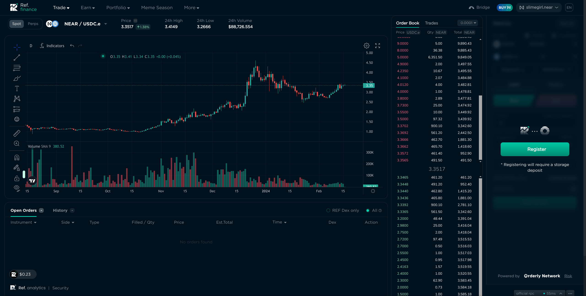

I have selected the pair NEAR/USDC.e, and in the top right corner we can see the balance
of my wallet and the balance of my Orderly account. Yes, earlier I said that the money
is taken from your wallet and is transferred directly into your wallet, but in Orderly
the money is taken from your wallet and is transferred to your Orderly account, and then
you can withdraw it to your wallet. This is done to make transactions execute faster
and to reduce the fees, which can be important for high-frequency traders.

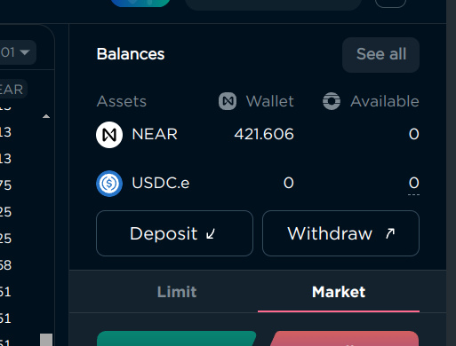

Let's deposit some NEAR to my Orderly account. Click "Deposit", specify the amount, and
confirm the transaction in your wallet:

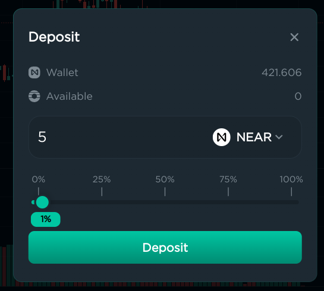

It may require a small (0.005 NEAR) [storage deposit](../lvl4/account-model/storage.md#storage-fee)
if it's your first time depositing this token to your Orderly account.

Now that we have 5 NEAR in the Orderly account, we can start trading. You can see that
there are 2 tabs: "Limit" and "Market". "Limit" works the same as the limit order
in the ref.finance swap menu, and "Market" works the same as "Swap". Limit has a few
advanced options:

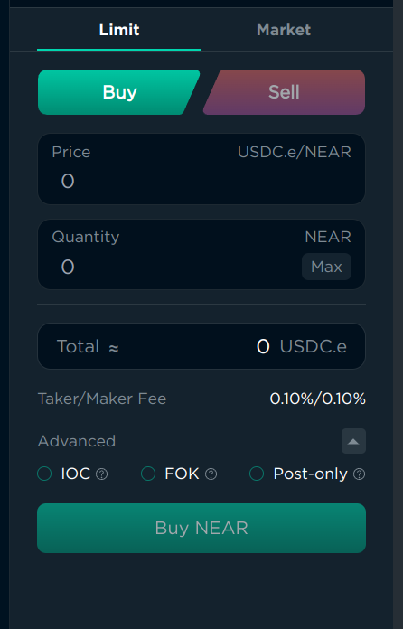

- "IOC" (Immediate or Cancel) will either execute the order immediately, or cancel it
  if it can't be executed immediately, if you don't want to wait for the price to change.
  It can be useful if you want to "Swap" but set the "Minimum received" manually. But I
  understand that it could be too hard, so I recommend using "Swap" or "Market" instead
  if you're a beginner.
- "FOK" (Fill or Kill) is similar to "IOC", but it will also not execute the order
  partially. This is also an advanced feature, and I recommend using "Swap" or "Market"
  instead if you're a beginner. If you're not a beginner, you probably already know what
  these options are used for, as they exist on all exchanges for professional traders.
- "Post Only" will only execute the order after it was added to the [order book](#order-book), and cancel
  if it would execute immediately. This is useful if the fees are lower for "maker" orders
  than for "taker" orders, but on spot trading the fees are the same, so it's almost useless,
  here, but useful on perpetual trading.

### Fees

You can see the fees under "Total", and they are separated into "Maker" and "Taker" fees.
You are a "Maker" if you add an order to the order book using "Limit" order that is not
executed immediately, and you are a "Taker" if you use "Market" order or "Limit" order
that is executed immediately. In our case, for NEAR/USDC.e at the time of writing it's
0.1% for both.

You pay this fee when you buy or sell tokens, and the other person also pays this fee,
so when you buy and sell $10, you pay $0.02 and other traders also pay $0.02.

### Order book

When you add an order, it's checked against the order book, and if the price can be
matched with an existing order, the transaction will be executed immediately. If not,
your order will be added to the order book, and it will be executed when someone
else adds an order that matches your price. You can see the order book in the middle
of the interface, and you can see the price, amount, and total amount of the orders
for the specific prices.

When you add a "Market" order, it will always match with the best price available in
the order book.

### Chart

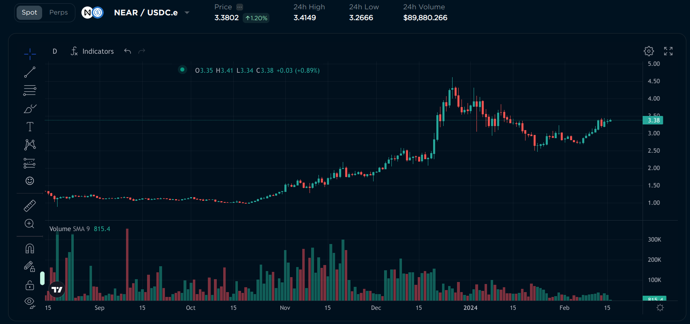

I won't teach you how to read candlestick charts or use TradingView, there are a lot
of tutorials on the internet about it. But above the chart, there are some useful
statistics:

- Price: The current price of the token
- 24h High: The highest price of the token in the last 24 hours
- 24h Low: The lowest price of the token in the last 24 hours
- 24h Volume: The total amount of this token traded on Orderly in the last 24 hours. High
  volume means that the token is popular and the prices are more stable, while low volume
  means that the token is not popular and the prices can differ from other exchanges.

### Opening orders

When you add a "Market" order, it will be executed immediately. When you add a "Limit"
order, it will be added to the order book, and you can see your active orders below
the chart. You can modify the order quantity and price by clicking the number (I know
it doesn't look clickable, but it actually is). You can also cancel the order by clicking
the "Cancel" button on the right.

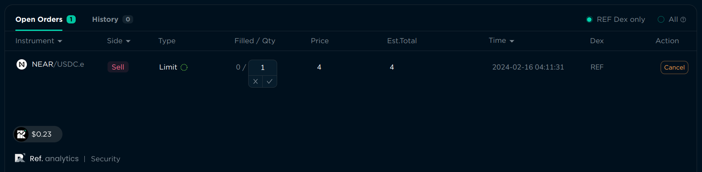

### Withdrawal

When you're done trading, you can withdraw your tokens to your wallet. Click "Withdraw"
in the top right corner, specify the amount, and confirm the transaction in your wallet.

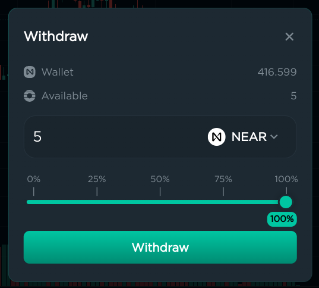

## Buying crypto with fiat

If you have USD or EUR or any other fiat currency, you can buy cryptocurrencies with it
on ref.finance using the "Buy" button in the top right corner. This is done using
Transak, a third-party service that allows you to buy cryptocurrencies with fiat. It's not available in all
countries, and the fees are usually higher than on exchanges, but it's one of the easiest
ways to buy cryptocurrencies with fiat without leaving ref.finance. Currently, only NEAR
can be bought with fiat, but you can always swap NEAR for any other token.

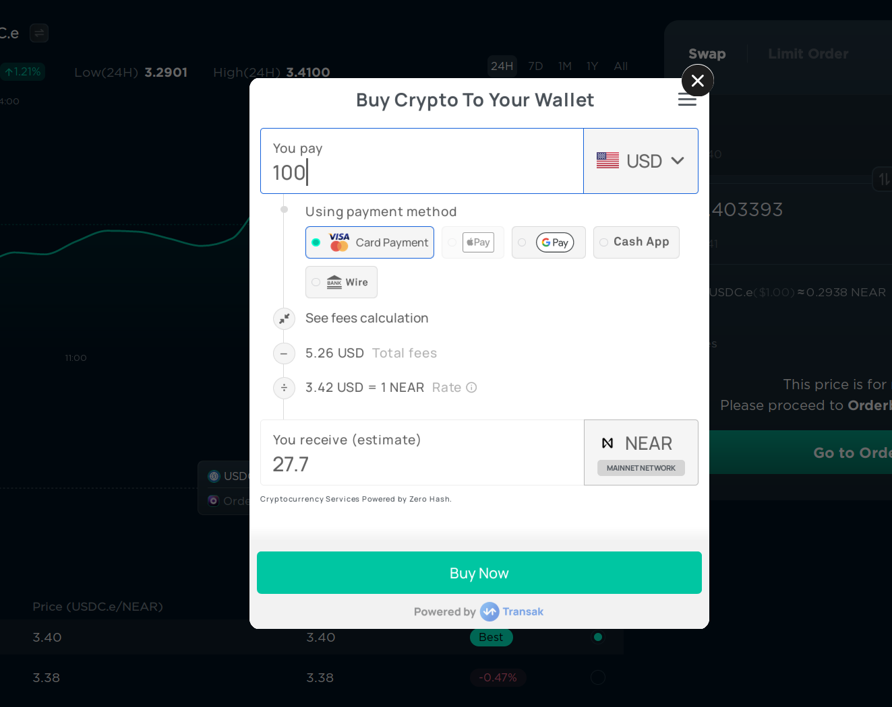

## CEX

CEX (centralized exchanges) are exchanges that are owned by a company, and they have
control over your tokens. They are usually faster and have more features than DEXes,
but they are also less secure and you have to trust the company that owns the exchange.

Here's the difference between DEXes and CEXes:

| Feature                         | DEX                                                                                                                                                                                                                       | CEX                                                                                                                                                                                                                                                                                                                                                                                                                                                        |
|---------------------------------|---------------------------------------------------------------------------------------------------------------------------------------------------------------------------------------------------------------------------|------------------------------------------------------------------------------------------------------------------------------------------------------------------------------------------------------------------------------------------------------------------------------------------------------------------------------------------------------------------------------------------------------------------------------------------------------------|
| Registration                    | [Connect](../lvl1/wallets/index.md#connecting-to-dapps) your wallet                                                                                                                                                       | You need to create an account on the exchange, deposit money, and then you can swap tokens from your account on the exchange. Usually exchanges also require you to verify an email, set up 2-factor authentication, complete KYC (upload your ID or other government-issued document + record a video of your face), and sometimes even wait for a few days for the verification to be completed. Some territories may be banned from using the exchange. |
| Ownership                       | When you swap, the money is taken from your wallet and is transferred directly into your wallet                                                                                                                           | The money is taken from your wallet and is transferred to your account on the exchange, and then you can withdraw it to your wallet                                                                                                                                                                                                                                                                                                                        |
| Speed of exchange               | Usually 3-5 seconds                                                                                                                                                                                                       | Usually 1 second                                                                                                                                                                                                                                                                                                                                                                                                                                           |
| Speed of deposit and withdrawal | Doesn't need a deposit or withdrawal                                                                                                                                                                                      | Usually less than 1 hour                                                                                                                                                                                                                                                                                                                                                                                                                                   |
| Fees                            | Usually 0.3% for 1 exchange (but can be changed for each token)                                                                                                                                                           | Usually around 0.1% for an exchange, and around $1 for withdrawal                                                                                                                                                                                                                                                                                                                                                                                          |
| Security risks                  | Can be hacked, but if you're only exchanging tokens there, your money is in your wallet, so it probably won't affect you much. There are security guarantees that the DEX's creator or developers can't access your funds | Can be hacked, and if all your money is in the exchange, it can be lost. Also, you have to trust the exchange to not block your account or to not steal your money (which happens quite often, even with the biggest exchanges)                                                                                                                                                                                                                            |
| Tokens available                | Anyone can add their tokens to a DEX, so a lot of NEAR-based tokens are available. But you need to be careful, because some tokens can be scams or have a very low liquidity.                                             | Usually only the most popular tokens are available, because the exchange checks if the project is legit. But it doesn't mean that the token is good, it just means that the project has money to pay for the listing and is not an outright scam. CEXes support tokens from multiple blockchains, not just NEAR                                                                                                                                            |
| Ease of use                     | Specify an amount and the token you want. But DEXes usually lack advanced trader tooling                                                                                                                                  | Usually CEXes have more advanced features. Could be hard to use for beginners who never traded anything, but experienced traders in other markets will find the interface familiar                                                                                                                                                                                                                                                                         |
| Fiat currencies                 | Usually not available, some DEXes may have a partner that allows you to buy tokens with fiat, but usually the rate is not the best.                                                                                       | Usually available, you can buy or sell your cryptocurrencies for your national currency                                                                                                                                                                                                                                                                                                                                                                    |

## OTC

OTC (over-the-counter) is a way to buy or sell tokens directly from another person,
without using an exchange. It's useful if you want to buy a lot of tokens at once without
[changing the price](#price-impact), or if you want to buy a token that is not
available on any exchange (for example, directly from the founder before listing).
When you use OTC, you have to trust the person you're trading with, or use a trusted
third party to hold the tokens until the transaction is completed, which usually costs
a fee. It's slower and less secure than using a DEX or CEX, so it's used very rarely.
