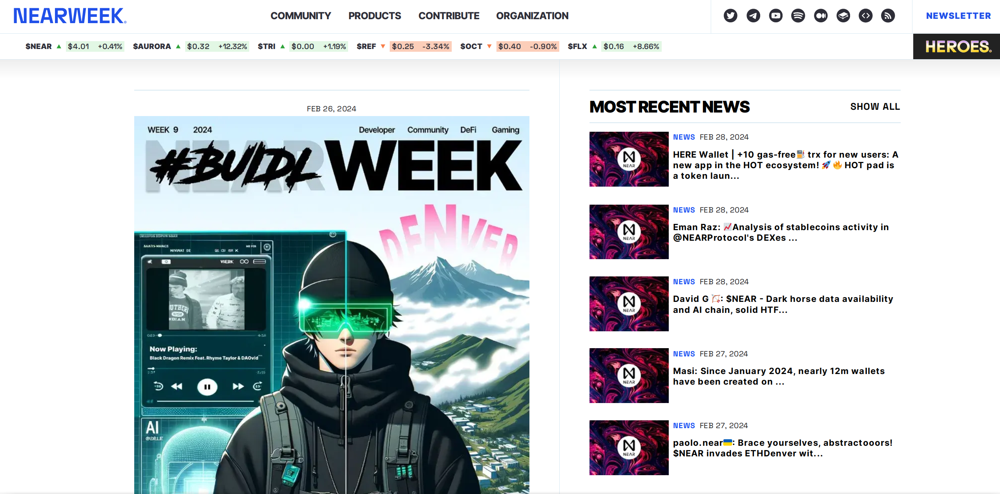
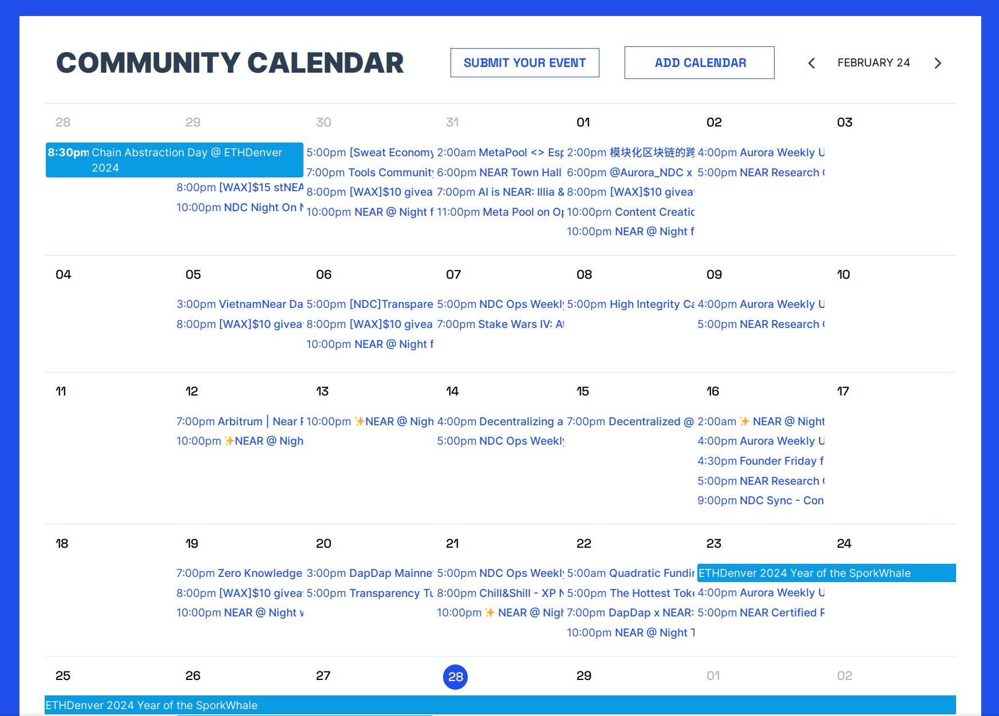
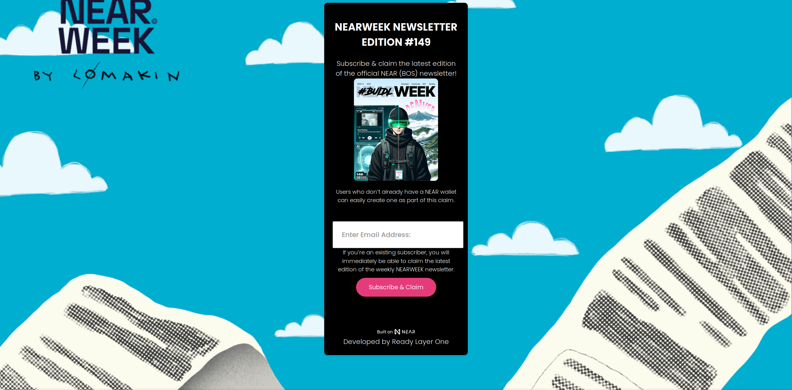

# NEARWEEK

NEARWEEK is one of the most popular news sources for the NEAR ecosystem. It is a weekly
newsletter that covers the latest news, updates, and events in the NEAR ecosystem. It is
a great way to stay updated with the latest happenings in the NEAR ecosystem. One of its
downsides is that there's rarely any alpha of upcoming projects that are not yet popular,
but that also means 

## Where to read it?

There are many ways to access NEARWEEK. You can read it on the [NEARWEEK website](https://nearweek.com/),
on [BOS](https://bos.nearweek.com), or you can subscribe to the newsletter to get it
delivered to your inbox every week.

NEARWEEK also has a [Telegram channel](https://t.me/nearweek_newsletter) with daily updates,
and [Twitter](https://twitter.com/NEARWEEK) for the latest news and updates.

## Community calendar

Not many are aware of this feature, but you can find the community calendar of NEAR ecosystem
events on the [NEARWEEK website](https://nearweek.com/). It is a great way to stay updated,
as listening to live events and Twitter spaces usually gives you the most up-to-date
information and more detailed insights.

## Subscribe

To subscribe to the NEARWEEK newsletter, visit [subscribe.nearweek.com](https://subscribe.nearweek.com/)
and enter your email address. You will receive the latest newsletter in your inbox every week.
Additionally, if you enter your NEAR account ID, you will receive a [free](shard-dog.md) NFT.

## Contributing

If you want to contribute to NEARWEEK and earn rewards, you can check the [NEARWEEK
documentation](https://docs.nearweek.com/start/newsletter/newsletter#nearweek-types-of-contribution).
But in short, the easiest way to let NEARWEEK know about something is to reply to a Twitter post
with `!submit @nearweekbot`.
