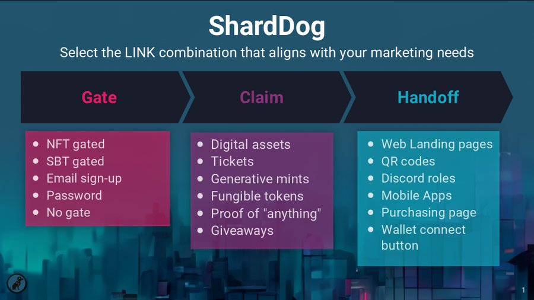
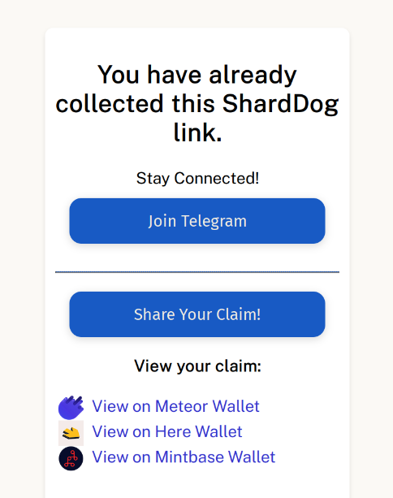

# ShardDog

[ShardDog](https://shard.dog/) a platform built on Near Blockchain that facilitates projects to reach a greater audience and increase their userbase using their free [NFT](../lvl1/nfts.md) or [FT](../lvl1/fts.md) drop feature, for a small fee based on project's scope. An alternative to ShardDog is [Bitte Drops](../lvl1/wallets/bitte-wallet.md#bitte-drops), which allows you to create drops without contacting ShardDog, and completely free, but only works with Mintbase Wallet users.

[A good thread about ShardDog](https://x.com/sharddog/status/1671543992171786242)

### How Shard.Dog works

1. Gate (who can access the drop)
2. Claim (the NFT or FT being dropped)
3. Handoff (how / where the user finds it)

The most important feature is a button "Share Your Claim!", which allows you to share your claim on Twitter, making it a good marketing tool.

### Let's Claim a ShardDog NFT Drop:

For this example, we're going to claim "Content! Content! Content!" NFT Drop.

<video src="./shard-dog.mp4" autoplay loop></video>

### Creating a ShardDog Drop

To create a sharddog, contact them and provide the details of your drop, most likely, the process is manual.

### Some examples

[HarvestMoon](https://shard.dog/harvest-moon) is probably the most claimed ShardDog, claimed by 100,000 wallet.

[Blackdragon](https://blackdragon.meme) is one of the first memes on Near Protocol (after Shitzu and Neko), it airdropped a lot of tokens to accounts that have interacted with popular NFT collections. Some drops cost thousands of dollars, if you didn't sell them at the beginning.
