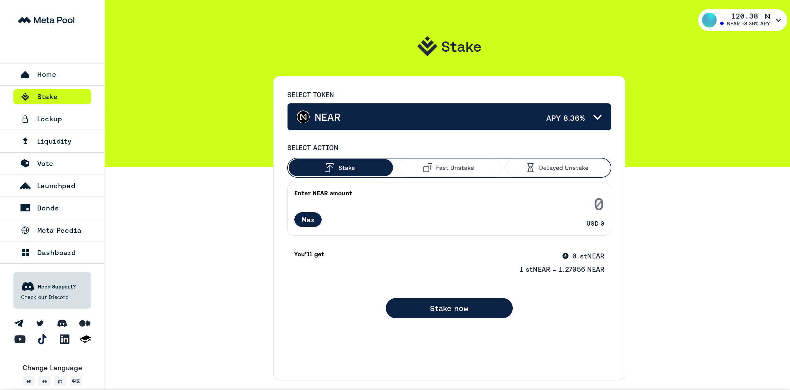

# Staking NEAR

If you hold a lot of NEAR, and plan to do so over a long period of time, you might want to
stake your NEAR. Staking is a way to help secure the network, and in return, you get a share
of the network's rewards. This is a way to earn passive income on your NEAR holdings. The APR
for staking NEAR is around 8% at the time of writing, but it can vary depending on how much
of the total NEAR supply is staked.

## Where does the APR come from?

The APR comes from the network's inflation. The network inflates the total supply of NEAR
by 5% per year, and this inflation is distributed to the validators and the people who
have staked their NEAR. The validators get 

## How does it help secure the network?

NEAR runs a Proof of Stake (PoS) consensus mechanism. This means that the network is secured
by validators who have staked their NEAR. The more NEAR a validator has staked, the more
likely they are to be chosen to produce a block. This is because the network is designed to
choose validators to produce blocks based on how much NEAR they have staked. This is a way to
incentivize validators to act in the best interest of the network, as they have a lot to lose
if they misbehave. But there are people who don't want to set up a validator node, maintain
it, solve technical issues, and so on. They can delegate their NEAR to some validator and
receive a share of the rewards. The validator will take a certain fee for providing this
service. So, how does your NEAR help secure the network? By staking your NEAR, you are:

- Increasing the total amount of NEAR staked, which makes it harder for an attacker to
  accumulate enough NEAR to attack the network. The network will stop if more than 33%
  of the total supply is staked by malicious actors.
- Choosing validators who are likely to act in the best interest of the network. The choice
  of a validator is your own, and you can choose a validator who you trust to act in the
  best interest of the network. I recommend choosing a validator who has a good track
  record, and doesn't have more than 3% of the total supply staked with them, as this
  could lead to centralization. If you know a person who runs the validator, it's even
  better, as you can trust them more.

If you don't know which validator to choose, you can check [near-staking.com](https://near-staking.com/)
and [nearscope.net](https://nearscope.net/), they have a list of validators and their
statistics, so you can choose a validator who you trust.

## Risks

Staking NEAR is not without risks. The main risk is that you could lose some or all of your
staked NEAR if the validator you have chosen misbehaves. This could happen if the validator
is hacked, or if they try to attack the network. The network is designed to punish (slash) corrupted
validators, but if you support a corrupted validator, you are also punished. This is why
it's important to choose a validator who you trust. You can also spread your stake across
multiple validators to reduce the risk of losing all of your stake.

## How to stake NEAR

To stake NEAR, you need to use a wallet that supports staking. Most wallets support
staking, and you can find the instruction for each wallet in the [Wallets](../lvl1/wallets/index.md)
section.

## Unstaking

When you stake NEAR, you lock it up for a certain period of time. This is because the network
reserves the right to take your stake if the validator you have chosen misbehaves. The
network may not be able to detect misbehavior immediately, so it locks up your stake for a
certain period of time to give it time to detect misbehavior. The period of time that your
stake is locked up for is called the "unstaking period". The unstaking period is currently
4 epochs, which is around 52-65 hours. This means that if you want to unstake your NEAR, you
will have to wait for 4 epochs before you can access it.

## Liquid staking

There are protocols that allow you to stake your NEAR, and receive a token that
represents your staked NEAR. This token is called a "liquid staking token". When you
want to get your NEAR back, you can exchange this token for NEAR, and you'll get more
NEAR than you originally staked, because you'll also get the rewards that the network
has given to your validator. Here's how it's done:

- You stake 10 NEAR with a liquid staking provider, and receive 8.5 stNEAR in return.
- You wait for a while, and the network gives the liquid staking provider some rewards.
  These rewards increase stNEAR's value, so now 1 stNEAR is worth 1.5 NEAR.
- You exchange your 8.5 stNEAR for 12.75 NEAR, and you've made a profit of 2.75 NEAR.

The main benefit is that you have a token that can be traded on [Ref](exchanging-tokens-ref.md),
deposited as collateral on [Burrow](../lvl3/burrow.md), and so on. The main downside is that
the liquid staking provider takes a fee for providing this service, making your APR a bit
lower.

Liquid staking also has unstaking periods. Most of them also offer a way to get your
NEAR back immediately, but you'll have to pay a small fee for this. Or if the amount
is not big, you can just [sell](exchanging-tokens-ref.md) your stNEAR.

Usually these protocols stake to a lot of validators at once, so the risk of losing your
stake is reduced. The most popular liquid staking providers are [Meta Pool](https://www.metapool.app/stake?token=near)
(stNEAR) and [LiNEAR Protocol](https://app.linearprotocol.org/) (LiNEAR). Some time ago,
there was NearX by Stader, but it sunsetted its operations in January 2024.

### A quick note about Octopus Network restaking

You can also stake your NEAR on the [Octopus Network](https://docs.oct.network/general/v2/octopus-restaking.html),
and receive a slightly higher APR, but Octopus Network is a separate project, and
everything said above may not be applicable to it (though, the concept is quite similar).
You should check the Octopus Network's [documentation](https://docs.oct.network/general/v2/octopus-restaking.html)
if you're interested.

## Staking of other tokens

Some other tokens on NEAR can also be staked, but the process is quite different. You
should check the documentation of the token to see if it's possible to stake it, and how.
Same goes about [NFT staking](../lvl1/nfts.md#staking).

## Troubleshooting

> I don't see any validators in my wallet

Try waiting for 1-2 minutes, the list of validators usually loads slowly.

> I don't see any rewards in my wallet

- Compare the amount of "Staked NEAR" with the amount you staked when you first staked.
  If the amount of "Staked NEAR" is higher, you've received rewards. Some wallets don't
  show rewards separately in the wallet, but you can see them in the transaction history.
- Try waiting for 1-2 days if you've just staked. The network doesn't give rewards
  immediately, it takes some time to calculate them. You will start receiving rewards
  from the *next* epoch after you've staked, and you'll receive them *after* the epoch
  ends.
- Check on [near-staking.com](https://near-staking.com/), maybe your wallet has trouble
  with showing rewards.

> I can't see my staking balance

If you used [liquid staking](#liquid-staking), you should check the balance of your
liquid staking token (stNEAR or LiNEAR), not the "staked NEAR" in the wallet. If you
staked normally and can't see your staking balance, check [near-staking.com](https://near-staking.com/)
to see if your wallet has trouble with showing staking balances. If it's not there, check
your transaction history to see if you unstaked and sent your NEAR to another account.
If there's no suspicious activity, your NEAR should be safe, it can't just disappear out of
nowhere, but you should contact the wallet's support, just in case.

## Becoming a validator

Becoming a validator is a way to earn more NEAR, since you don't have to pay a fee to
a validator, and you can take a fee from other people who delegate their NEAR to you.
But it's also a big responsibility, as you have to rent a high-spec server, maintain a
validator node, even setting it up requires some technical knowledge. If you're interested
in becoming a validator, you should check the [NEAR documentation](https://docs.near.org/concepts/basics/validators),
join the [NEAR Discord](https://discord.gg/WC4vvR8nNn) and [NEAR validators telegram](https://t.me/near_validators)
