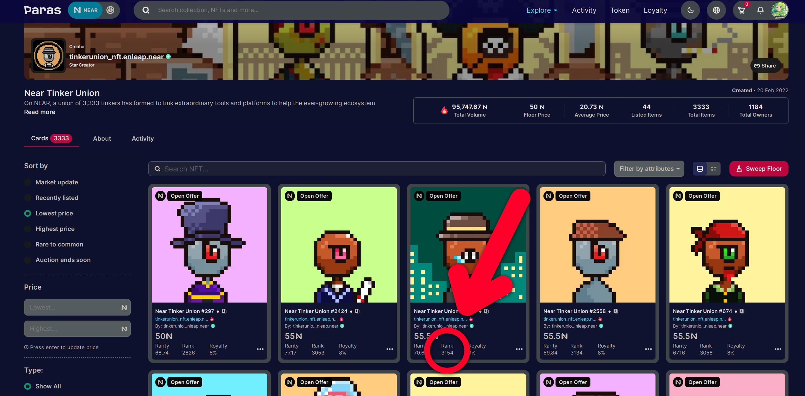
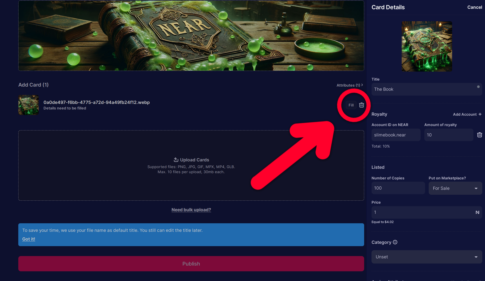

# Paras

[Paras](https://paras.id) is an [NFT](../lvl1/nfts.md) marketplace on NEAR. It allows creators to mint NFTs
and collectors to buy, sell, and trade them. As far as I know, the Paras team is currently
working on another project, and Paras is not being actively developed, has many broken
links and outdated content, but it's still usable, lists new collections, and is probably
the most popular NFT marketplace on NEAR, followed by [Mintbase](../lvl4/mintbase.md).

## Discovering collections to buy

Probably the best way to find NFTs to buy is to follow the creators you like on social media
and see if they have any NFTs for sale. If you are actively monitoring social media, you
will quite often find new NFT collections that will increase in price when the masses find
out about them.

But if you are not actively monitoring social media, you can also use the Paras marketplace
to find NFTs to buy. On the [homepage](https://paras.id), you can see the top collections
in 7 days, sorted by trading volume:

Below the top collections, you can see "More Featured Collections", "Apex Collector Buys Today",
"Highest Sales", "Whats Happening", but I don't recommend using these to find NFTs to buy,
because some of them are not updated frequently and some of them are just not meant for
discovering new NFTs to buy.

## Which NFT to buy in a collection?

First of all, decide the reason why you are buying an NFT:

- Do you want to just support the creator and buy the NFT you like? Then just buy the one you like.
- Does it have a utility, like access to a community, a game, or can be staked to get [FT](../lvl1/fts.md)?
  Buy the cheapest one with the utility you want. The cheapest NFT price in a collection is
  called the collection's "floor" price.
- Do you want to buy it to sell it later for a profit? Most likely, you will want to buy the cheapest one,
  but it's not always the case. Sometimes the rarest NFTs have the highest potential for profit.

Most NFTs are not the same: they have a rank, traits, or other attributes that make them
unique. For example, let's take Near Tinker Union:

If you do some research, you will find out that these NFTs can be staked to get $GEAR,
and the amount of GEAR depends on the rank of the NFT. The rank is visible below the
price on the NFT card. Let's take another example, NDC Baddies:

These NFTs don't have a utility as of writing, purely a speculative asset, but they have attributes - you can filter
NFTs by "Body Traits: Sailor Sanic" and see all NFTs with this trait. They will usually
have something in common, like the same clothes, and they may be more or less valuable
depending on their attributes and uniqueness. But most people just buy the cheapest one
and don't care about attributes, so don't overthink it. Here's another example, B💀NEHEDZ:

Personally I don't care about the rarity of this NFT or its rank, I just want Gojo
Satoru, so I buy him and enjoy the rest of my life.

> It's very important to check the NFT activity in the "Activity" tab. If the
> NFT has a lot of sales, it's probably a good buy, but if you see that there's a
> good volume but it's all from the same person, it could be wash trading - the
> person is buying and selling the NFT to themselves to increase the volume and
> make it look like the NFT is popular. But it's always a good idea to check the
> project's social media and double-check the activity.

## Buying an NFT

Click the NFT to open its details:

You can see the price, the rank, rarity score (no one really uses it as of writing),
royalty percentage, and the owner. If you want to buy it, click "Buy Now" and confirm
the transaction in your [wallet](../lvl1/wallets/index.md).

If you scroll down, you can see the NFT's attributes, transfer history, and other
information.

## Sweeping floor

If you want to buy a lot of the cheapest NFTs in a collection, you can use the
"Sweep floor" button. It will buy all the NFTs with the lowest prices in the
collection.

## Adding an offer

While buying an NFT is a simple way to get it right now, using offers is a very
underrated way to get NFTs for a lower price. If you are not in a hurry, you can
add an offer (using "Make your own offer" button) and wait for the owner to accept it.
I recommend setting the offer to 10-20% lower than the current price, but it's up to you.
If you're adding an offer to a floor NFT, there's a good chance the owner is desperate
to sell it here and now, so quite often it actually works and you get the NFT for a lower price.

When a seller accepts your offer, you will get a notification in the top right corner.
Remember that when you add an offer, the amount of NEAR you offered will be locked
in Paras until the offer is accepted or canceled, and if you add a lot of offers in
hopes that one of them may be accepted, they may all be accepted at the same time,
so be careful with that.

When you receive an offer, it will appear in the notifications in the top right corner.

## Selling an NFT

Once you have an NFT, you can navigate to your profile and click "Sell" to list it.
The link is `https://paras.id/account.near`, or you can click your profile picture
in the top right corner and click "Open Profile". Click the NFT you want to sell,
click "Edit Listing", set "Put on Marketplace?" to "For Sale", and "Update Price" to
the price you want to sell it for. Then click "Update" and confirm the transaction in
your wallet.

> Note that if you [staked your NFT](../lvl1/nfts.md#staking), most likely it won't appear in your profile, and
> you will have to unstake it first.

For the NFT trading part, that's it. But Paras also has an ability to create an NFT
collection, and you can do that by clicking "Create Collection" in the top right
corner:

Next, fill in the details, upload the images, and click "Continue":

Add a wide cover image and some NFTs. I added one:

You can edit the NFT details by clicking "Fill" next to each card:

If you want to add an attribute, fill "Label" as the attribute name and "Value" as
one of the attribute values. Then click "+ Value" and add another value. You can
add as many values as you want, and as many attributes as you want. Then click "Save".

When you're done editing the cards, click "Publish" and confirm the transaction in your
wallet. Your collection will be published and the cards will appear shortly. Here's
our collection: [(click here)](https://paras.id/collection/slimebook-by-slimegirlnear)

You can always edit the collection by clicking "Edit Collection" on the right.

## $PARAS token

$PARAS is a loyalty token that you can stake on [stake.paras.id](https://stake.paras.id)
and get rewards in PARAS and NEAR tokens.

In addition, if you lock your PARAS for at least a month (locking means that you can't
unstake it until the lock period ends), you will upgrade your profile. The upgrade level
depends on the amount of PARAS you lock:

| PARAS | Upgrade level |
|-------|---------------|
| 0     | Bronze        |
| 500   | Silver        |
| 1000  | Gold          |
| 3000  | Platinum      |

If you want to lock your PARAS, you need to first stake it, and only then there will
be an option to lock it.

At the time of writing, the upgrade levels don't give you any benefits, but you can
check the [loyalty](https://paras.id/loyalty) page to see if anything has changed.

> [stake.paras.id](https://stake.paras.id) also allowed you to stake certain NFTs to get
> rewards in PARAS and NEAR tokens. But at the time of writing, the last staking round
> ended almost 2 years ago, so there's a good chance that you won't see anything there.
