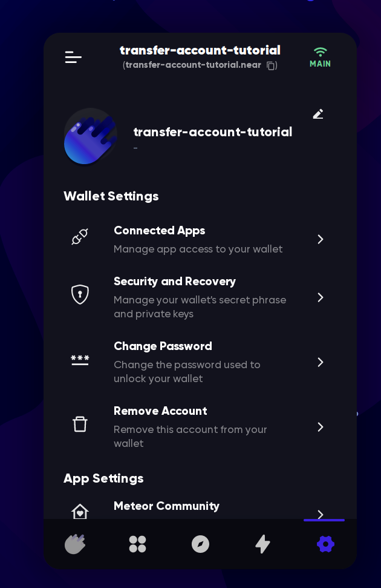
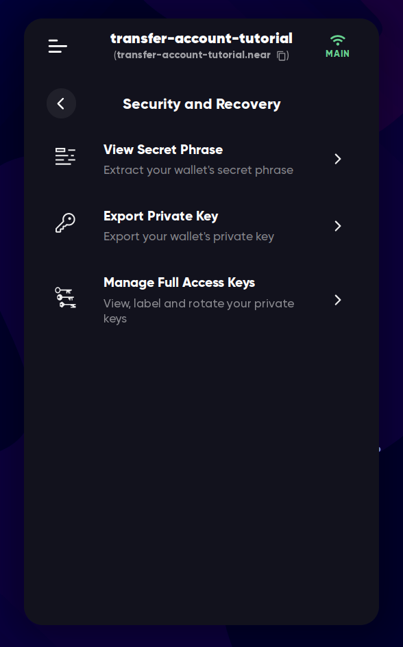
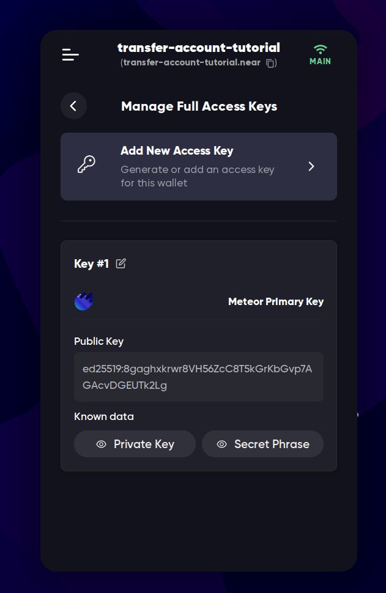
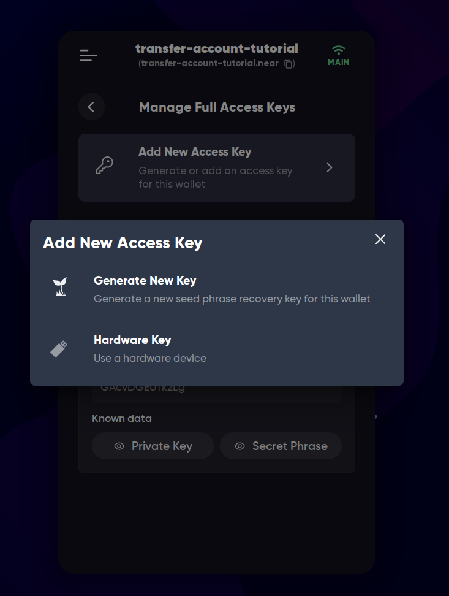
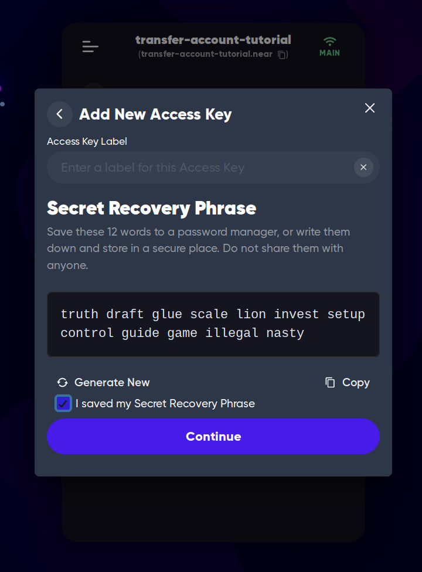
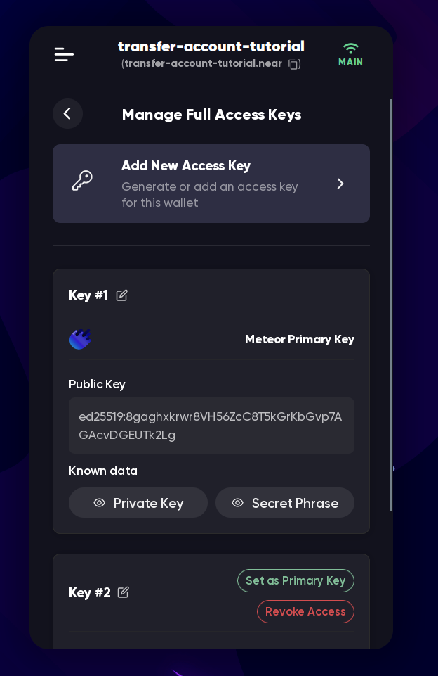
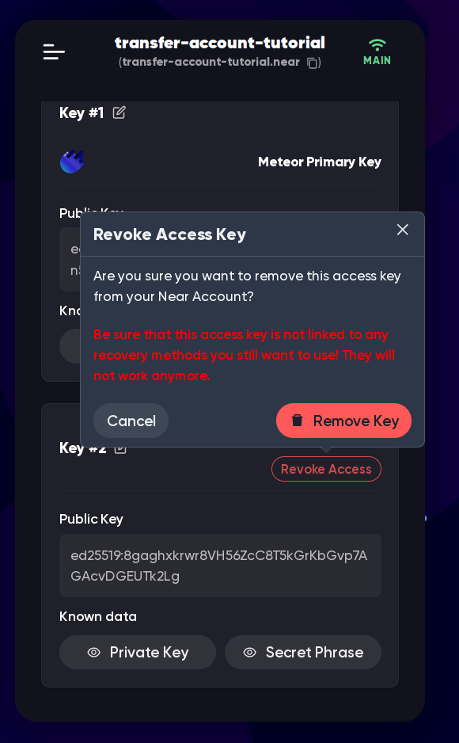
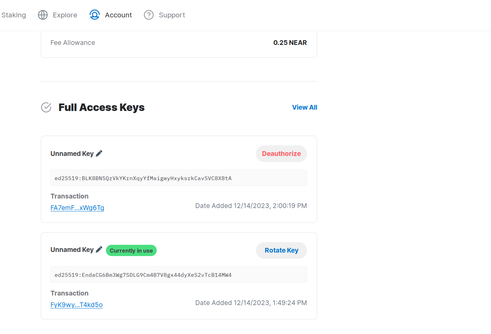

# Transfer accounts (change account keys)

On most blockchains, if you leak your [seed phrase](where-to-save-seed-phrase.md), you
give full access to your account to anyone who knows it. You have to transfer your funds
to a new account, and you can't use the old account anymore, as the hacker can set up
a bot that will transfer all the funds from your account as soon as you receive them.
But on NEAR, you can just change your keys, and the old key will be useless. This is
called "key rotation". Note that a hacker can also change your keys, so if you think
that your account may be compromised, you should act quickly.

## Why use it?

There are a few reasons why you might want to change your account keys:

- You lost your seed phrase, but you still have access to the wallet, and you want to
  create a new seed phrase to restore your account in case you lose access to the wallet.
- You think that your old key might be compromised, and you want to create a new one.
  If you've leaked your seed phrase, or if you've used it on a compromised device, you
  should definitely change your keys. This is the same as changing your password on
  other websites.
- You have a [soulbound NFT](../../../lvl1/nfts.md#soulbound-nfts) or a non-transferable
  token, and you want to transfer the account to another person. You can't just give them
  the seed phrase, and the other person changes the keys so that you can no longer access
  the account.

## How to do it?

> WARNING: This is a dangerous operation. If you do something wrong, you won't be able to
> recover access to your account. Make sure you have a clear understanding of how [keys](index.md)
> work before doing this, and avoid doing this unless absolutely necessary.

The process is actually simpler than it sounds. You just need to create a new full access
key, and then delete the old one. Here's how you can do it in [Meteor Wallet](../../../lvl1/wallets/meteor-wallet.md):

### Meteor Wallet

1. Open the wallet:
   
2. Click "Security and Recovery"
   
3. Click "Manage Full Access Keys"
   
4. Remember your existing public key, you can copy it somewhere, or just remember the
   first 3 characters
5. Click "Add New Access Key"
   
6. Click "Generate New Key" (or if you want to transfer to a hardware device, choose
   this option)
   
7. Save the seed phrase, and click "Continue"
8. When the key is added, the "Manage Full Access Keys" page will look like this:
   
9. Either
    - Click "Set as Primary Key" near the new key so that the wallet now uses the new
      key to sign transactions. The new key is **not** the one that you remembered in
      step 4
    - Logout from your account and login with the new phrase
10. Now you can delete the old key by clicking "Revoke Access" next to it. The old key
    is the one that you remembered in step 4
    

Now try to login with your old phrase/key, and you should see that it doesn't work
anymore. If you want to be sure, you can check the account's keys on the [explorer](../../../lvl3/nearblocks.md)
or in the wallet.

This method works in all wallets that offer full key management, but the interface might
look different.

## MyNearWallet

In MyNearWallet there is even a button to do it in one click: "Rotate Key", but you
need to manually specify a new seed phrase, it can't auto-generate a random one for you.
Don't copy/paste the seed phrase from a "seed phrase generator" website, as it can save
the phrase and steal your funds later. I recommend using another wallet, or creating a new
account and using the phrase from it.

