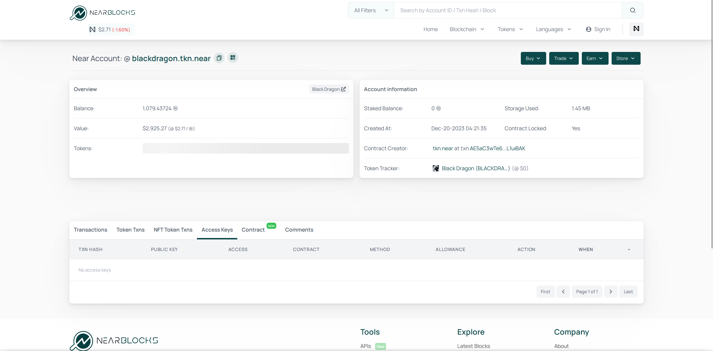

# Storage fee

There's no such thing as free storage. When you store something on the NEAR
blockchain, you pay for it. The price is low (1 NEAR for 100kb), but when
millions of users store their data, it becomes a significant amount of money.
Not to mention, [sybil attacks](https://docs.near.org/develop/contracts/security/sybil)
can quickly drain the developer's balance. That's why **users** have to pay for their
storage. The good thing is, as soon as you delete the data, your money is fully refunded.

An average NEAR account costs about 0.06 NEAR to maintain, this amount is usually
deducted from your first deposit of NEAR. You can refund it to another account if you
delete your account.

After that, the most common thing that you'll store is token balances. Usually the fee is
between 0.01 and 0.1 NEAR for each token, and it's paid when you receive your first token.
For [FT](../../lvl1/fts.md)s it's paid once per account, so if you already have a balance
of that token, you won't have to pay it twice.

Technically, the storage fee is not paid, it's frozen on the account that stores data.
If you use an [FT](../../lvl1/fts.md), the data is stored in the FT contract, which acts
as a bookkeeper, so the fee is paid to the FT contract and it's frozen there. If an account
doesn't have enough NEAR to pay for storage, the transaction fails.

#### Why are balances stored in a smart contract, and not in my account directly?

Every account can modify its own data, it would be easy for you to modify your balance.

#### If so, can the creator of the token modify my balance?

If we're talking about the most popular tokens, no, they can't. But for some tokens, yes,
it can be done in 2 ways:
- The token creator can have a special function in the contract that allows them to modify
  the balances. Usually this means that the token is a [scam](../../lvl3/scams.md#backdoors),
- The token has a [full access key](keys/index.md#full-access-key). This means that the
  token creator can do anything with the account, including modifying the balances, modifying
  the token contract to add this "special function", just anything.

#### How to check if the token has a full access key?

You can check it on the [explorer](../../lvl3/nearblocks.md):

As we see, **$BLACKDRAGON** doesn't have any access keys, so it can't modify the
balances, unless there is a special function, which is currently hard or impossible
to verify. Tokens ending in `.tkn.near` are generally considered safe, as they are
all created using the same "template", which doesn't have any special functions.

## Smart contracts

[Smart contract](../../lvl3/smart-contracts.md) code also requires storage, the bigger the
contract is, the more NEAR it requires to have. The transaction data, that is available
on the [explorer](../../lvl3/nearblocks.md), doesn't require storage, since it's not stored
on the blockchain, and dismissed[^1] right after the transaction ends.

[^1]: The full transaction history, including the transaction data, is stored in the
      [archival nodes](../../lvl6/node-types.md) and indexers.
