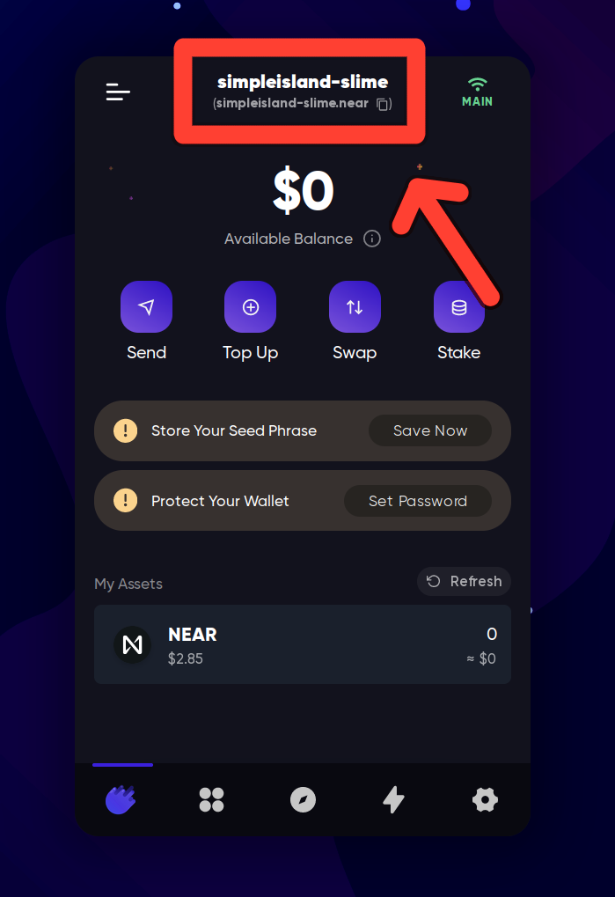
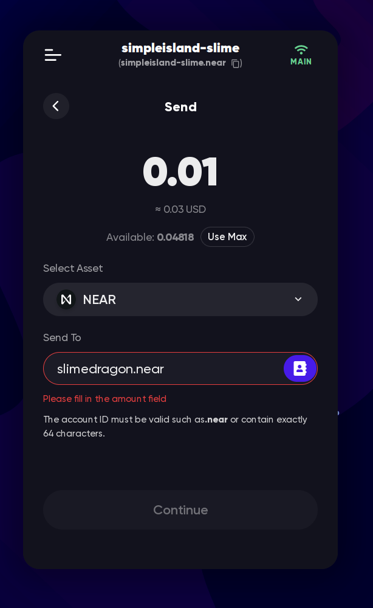

# Meteor Wallet

[Meteor Wallet](https://wallet.meteorwallet.app/add_wallet/create_new?postfix=slime)
is (in my opinion) the simplest and most user-friendly NEAR wallet. It's a web
wallet that can also be used as a Chrome extension.

To create a wallet, open the [Meteor Wallet](https://wallet.meteorwallet.app/add_wallet/create_new?postfix=slime)
website and enter your username:
<video src="meteor-wallet-create.mp4" autoplay loop>
Yes, as simple as that.

## Next steps
Now you can move some NEAR in your wallet or continue exploring other Meteor
Wallet's features.

### Receiving NEAR
When someone asks you for your NEAR account, you can give them your username.
If you have some cryptocurrency on another blockchain, you can bridge it to NEAR.
I don't like to explain the concept of bridges, especially with [Chain Abstraction](../../lvl7/chain-abstraction.md)
coming in the next months, but if you're bridging from Ethereum, maybe I'll write
something about [Rainbow Bridge](../../lvl2/rainbow-bridge.md).

In the example above, it will be `simpleisland-slime.near`[^1]. If you use an
exchange like Binance, you should specify this username as your address (because
it is your address!)

If you're transferring from an exchange, depending on the exchange, it can take
1-30 minutes for the transfer to come, but transfers between wallets usually take
1-2 seconds.

### Sending NEAR
To send NEAR to someone, you need to know the recipient's account ID (username).
When you have it, you can send NEAR to them:

(TODO add a gif when this bug is fixed)

### [NFTs](../nfts.md)
Meteor Wallet has a built-in NFT viewer, where you can see your NFTs in the wallet,
view their traits, floor prices, transfer NFTs, and more.

### [FTs](../fts.md)
You can receive fungible tokens using the same account name, and sending them to
someone else is almost exactly the same as sending NEAR.

<video src="meteor-wallet-send-ft.mp4" autoplay loop>

(TODO add point system, connecting to dapps)

[^1]: If you're coming from a different blockchain, you might be used to having
a long string of characters as your address. NEAR mostly uses human-readable
names instead, and you can have multiple accounts under the same name.
Don't confuse this with ENS or similar services, NEAR names are not a
good-looking mapping to an address - **it IS** your address. More information about
addresses: [NEAR Accounts](../../lvl4/account-model/account-ids.md).
