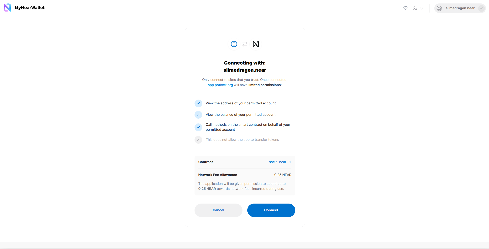
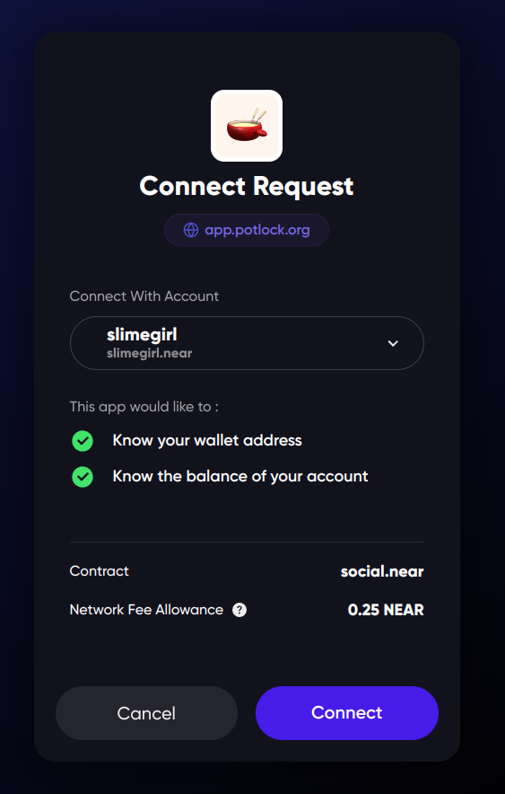
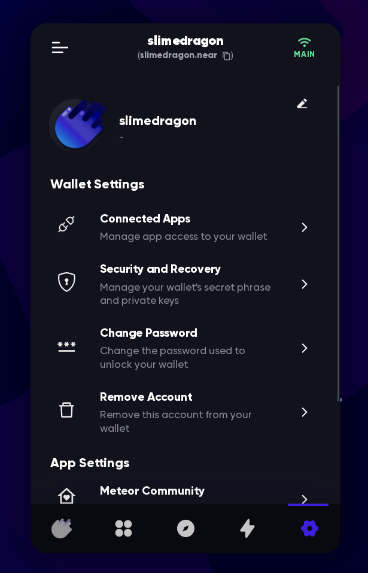
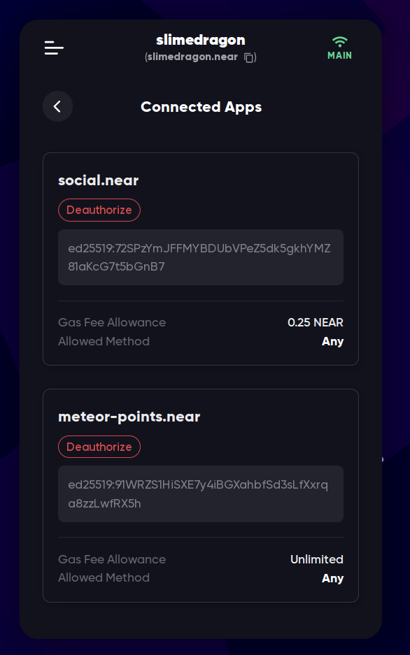
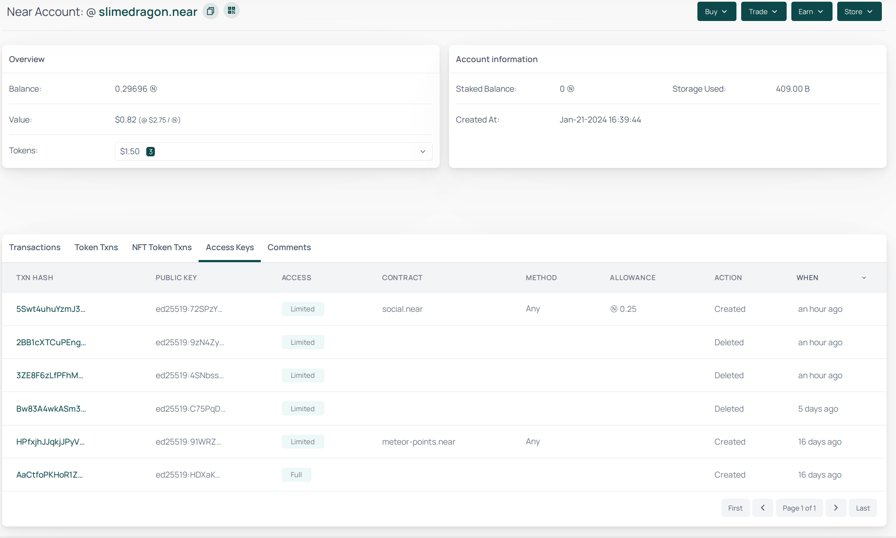

# Access Keys

You can access your account only if you have a key to it. A key is usually created when
your account is created, but you can add more keys to your account, and remove them.

In NEAR keys are permission-based. That means we can restrict the access of a key to
only some actions. For example, we can create a key that can only publish posts
on [near social](../../../lvl3/near-social.md),
but can't transfer tokens.

## Types of keys

There are 2 types of keys:

- Full access key
- Function call access key

### Full access key

This key can do anything on the account. It can transfer tokens, change the account's
keys, and even delete the account. It's like the master key of the account. This key
is usually created when the account is created, and it can create other keys. This is
the key that is stored in your [wallet](../../../lvl1/wallets/index.md). You can also
create multiple full access keys in the same account, if you want.

### Function call access key

This key can only call certain methods on certain [smart contracts](../../../lvl3/smart-contracts.md). It can't transfer
tokens, change the account's keys, or delete the account. This key is usually used by
dapps to interact with their contracts using your account, without your confirmation in
the wallet. But it can't send NEAR in these transactions, so it's safe to create these
keys. They can request allowance some amount of NEAR to pay [gas fees](../../transactions.md#gas-fees).

> But what about my [FTs](../../../lvl1/fts.md) and [NFTs](../../../lvl1/nfts.md)? Can
these keys send them?

You have to check what contract and what method the key can call before creating it.
Here's what it looks like in [MyNearWallet](../../../lvl1/wallets/my-near-wallet.md):

In [Meteor Wallet](../../../lvl1/wallets/meteor-wallet.md) it doesn't say that this
key can call methods, but it actually can, it's just not displayed:

This dapp wants us to create a key that can call all methods of `social.near` smart
contract, and use up to 0.25 NEAR for [gas fees](../../transactions.md#gas-fees).
Note that it doesn't use your 0.25 NEAR right away, your NEAR stays in your account,
but the dapp can use some portion of it to pay for the transactions that it sends.
0.25 NEAR is the standard amount that dapps request, so even if you think this dapp
shouldn't need this much, it's probably safe to create this key.

> In theory, a malicious dapp can send a lot of transactions and use up its allowance
> of 0.25 NEAR, and grab [30% of the fees](../../transactions.md#developer-incentive)
> for itself, making 0.075 NEAR of each user, but it's not worth the effort, and users
> can't lose more than 0.25 NEAR, so don't worry about this. But it's also possible to
> request unlimited allowance, so be careful with connecting to dapps.

But if it was something like `usdt.tether-token.near`, we would have to be careful,
because it can call the `transfer` method, and transfer all our USDT to someone else.
Make sure that the app requests only the permissions it needs, or permissions to access
its own contract.

But even if you give an app access to a token contract, most likely, it still can't
transfer the tokens. Users normally don't check the contract address before connecting
to an app, making it vulnerable to phishing attacks, so token developers need to have
a way to protect their users from this. That's why most token contracts require you to
attack 1 yoctoNEAR (0.000000000000000000000001 NEAR) to the call, and since function
call keys can't send NEAR, they can't call the transfer method and steal your tokens.

Transactions that send any amount of NEAR or interact with a different contract are
always confirmed in the wallet, so you can always see what the app is trying to do
with your account.

### Revoking access keys

If you no longer want a key to have access to your account, you can remove it. This is
called "revoking" the key. You can do it in your wallet. I'll show you how to do it
in [Meteor Wallet](../../../lvl1/wallets/meteor-wallet.md):

1. In the settings, click "Connected Apps"
   
2. Find the key you want to revoke, and click "Deauthorize"
   

## How keys work

Full access keys are created like this:

1. A wallet generates a "seed phrase" - usually it's a list of 12 words that you have
   to save somewhere safe, as it gives its owner full access to the next steps. This step
   is optional, you can just use the private key (it looks like `ed25519:<symbols>`),
   but it's harder to remember
2. The wallet converts the seed phrase to a "private" full access key. This key is stored
   in the wallet, and in some wallets you can export/import it directly, without the need
   of the seed phrase. It's called "private" because you have to keep it private
3. The wallet converts the "private" full access key to a "public key" - a representation of this
   key that can be shared with others. With this key, it's possible to ***verify*** that a
   [transaction](../../transactions.md) was signed by the key, but it's not possible to
   sign transactions with it
4. When your account is created, the public access key is added to it. This is the key
   that is used to verify that the transactions were signed by the full access key
5. Now the wallet can use the full access key to sign transactions, and send them to the
   network. Network then verifies that the transaction was signed by your key, using
   the public key (it's a lot of maths that we'll skip in this book[^1], but just know that
   it's possible to verify but not to sign with the public key, that's why it's called
   "public")

TODO: Add a gif of the process

> You don't have to care about function call keys, they are created by dapps and are
> managed by the dapps themselves. But in short: the private key is stored in the dapp's
> website, and the public key is added to your account.

If someone knows your seed phrase, they can convert it to your full access key, and
then sign and send transactions with it. That's why it's important to [keep your seed
phrase safe](where-to-save-seed-phrase.md).

Both private keys and public keys are just a bunch of bytes, but in NEAR they are
represented as a string of characters, prepended with `ed25519:`. For example, a key
can look like this: `ed25519:72SPzYmJFFMYBDUbVPeZ5dk5gkhYMZ81aKcG7t5bGnB7`.
`ed25519` means that it's an [Ed25519](https://en.wikipedia.org/wiki/EdDSA) key, and
the rest is the key itself. I won't dive into the complicated maths behind it in this
book, but just know that it's the name of the key algorithm.

All public keys are stored on the blockchain, and can be viewed by anyone:

## What can you do with this key system?

Using this flexible and permission-based key system, you can do things like:

- [Transfer your account](key-rotation.md) to a new key
- If you for some reason want to share your account with someone, you can create a
  new full access key, and give it to them. They will be able to do anything with
  your account, and you can see which key was used to sign a transaction, so you can
  always know who did what, and remove the key if you don't want them to have access
  anymore. But note that they can also remove your key, so be careful with who you trust
- If you're playing a game that requires you to sign a lot of transactions, and you
  don't want to click "confirm" every time, the game can ask you to create a function
  call key that can only call the game's contract, and then use it to sign transactions
  without your confirmation, while still being unable to transfer your tokens

[^1] If you're interested in the maths behind this, you can read about
[elliptic curve cryptography](https://en.wikipedia.org/wiki/Elliptic-curve_cryptography),
which is used in NEAR and many other blockchains. TODO: find an easier explanation and link it here
